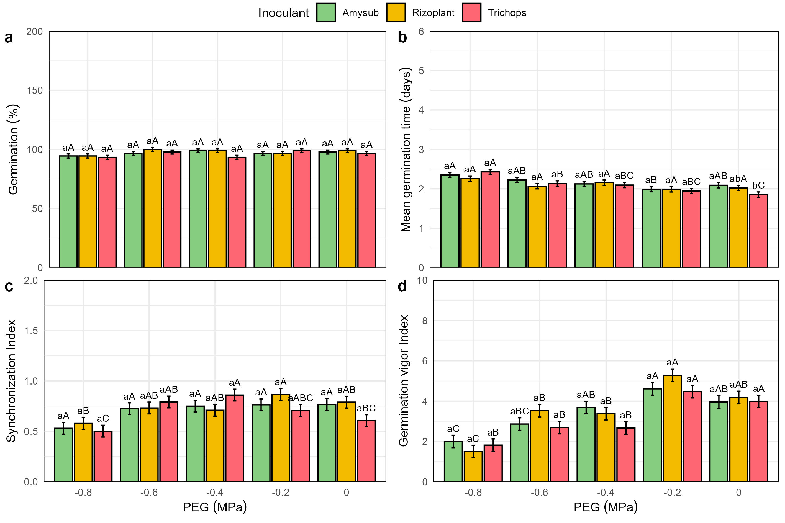
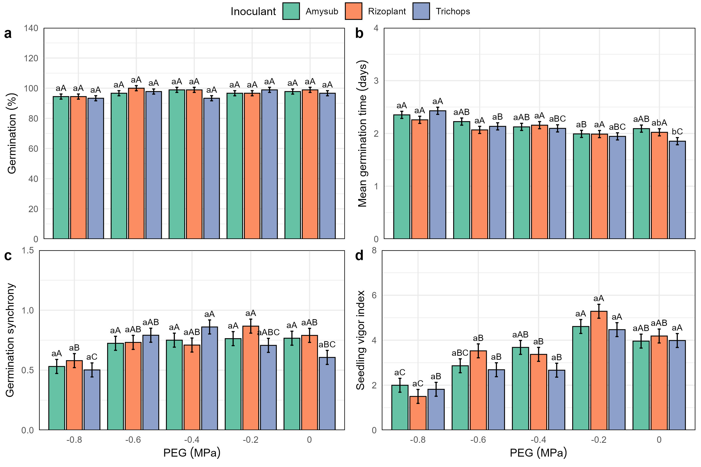

# Project Setup

```{r}
#| label:  setup
library(emmeans)
library(corrplot)
library(multcomp)
library(FSA)
library(agricolae)
library(tidyverse)
library(car)
library(lme4)
library(googlesheets4)
library(factoextra)
library(FactoMineR)
library(GerminaR)
source("https://inkaverse.com/setup.r")
```

# Data import

```{r}
gs <- "https://docs.google.com/spreadsheets/d/1GgfIOmTGyvjtuVQzJgFA8ueD1yqRh7x7gyueLdQVd90/edit?usp=sharing" %>%
  as_sheets_id()

germination <- gs %>%
  range_read(ss = ., sheet = "STable2") %>%
  mutate(across(1:9, as.factor)) %>%
  mutate(peg = factor(peg, levels = c("-0.8", "-0.6", "-0.4", "-0.2", "0")))

glimpse(germination)

inoculation <- gs %>%
  range_read(ss = ., sheet = "STable3") %>%
  mutate(across(1:6, ~ as.factor(.)))

glimpse(inoculation)

climate <- gs %>%
  range_read(ss = ., sheet = "STable4") %>%
  mutate(across(1:2, ~ as.factor(.)))

glimpse(climate)
```

# Data summary

Summary of the number of data points recorded for each treatment and evaluated variable.

```{r}
sm <- germination %>%
  group_by(Inoculant) %>%
  summarise(across(starts_with("ger"), ~ sum(!is.na(.))))

sm %>% kable(align = "c")

sm <- inoculation %>%
  group_by(Site, treat) %>%
  summarise(across(pl_height:yield, ~ sum(!is.na(.))))

sm %>% kable(align = "c")
```

# Research Objective

1. To evaluate the effects of bio-inoculation and PEG 6000 stress on pea seed biomass, weight, and germination on pea crop.

> Figura: Proceso germinativo de arverja inoculados co bioestimulantes en condicioens de estres hídrico simulado. (a) Gerinación (%). (b) Tiempo medio de Germinación (c) Sincronia de la Germinación. (d) Indice de vigor de la germinación
(e) Peso se las radiculas

> PCA germinación

1. To demonstrate the combined effects of bio-inoculation and fertilization on field experiment on pea crop

- Correlación de las variables por ambiente
- Una MLT y calcular las medias ajustadas (BLUEs)

> Figura: Las variables de campo

> Figura: PCA

## RO 1

To evaluate the effects of bio-inoculation and PEG 6000 stress on pea seed biomass, weight, and germination on pea crop.

### Germination (%)

#### Performe ten germination indices

```{r}
# germination analysis (ten variables)

gsm <- germination %>%
  ger_summary(
    factors = c("Inoculant", "peg", "block"),
    SeedN = "seeds",
    evalName = "ger_",
    data = .,
    cumulative = T
  )

# Pea data set processed

gsm %>%
  head(10) %>%
  mutate(across(where(is.numeric), ~ round(., 2))) %>%
  kable(caption = "Function ger_summary performe ten germination indices")
```

#### Germination Percentage (GRP)

```{r}
# analysis of variance

av <- lmer(grp ~ 1 + (1 | block) + Inoculant * peg, data = gsm)

Anova(av, type = 3, test.statistic = "F")

mc1 <- emmeans(av, ~ peg | Inoculant) %>%
  cld(Letters = letters, reversed = T) %>%
  mutate(across(".group", ~ trimws(.))) %>%
  rename(sig1 = ".group")

mc2 <- emmeans(av, ~ Inoculant | peg) %>%
  cld(Letters = letters, reversed = T) %>%
  mutate(across(".group", ~ trimws(.))) %>%
  mutate(across(".group", ~ toupper(.))) %>%
  rename(sig2 = ".group")

mc <- merge(mc2, mc1) %>%
  unite(col = "group", c("sig1", "sig2"), sep = "") %>%
  arrange(Inoculant, desc(peg))

mc %>% kable(caption = "Germination percentage mean comparision")

grp <- mc %>%
  fplot(
    data = .,
    type = "bar",
    x = "peg",
    y = "emmean",
    group = "Inoculant",
    ylimits = c(0, 200, 50),
    ylab = "Germination ('%')",
    xlab = "Inoculant",
    glab = "PEG (MPa)",
    error = "SE",
    sig = "group",
    color = T
  )

grp
```

#### Mean Germination Time (MGT)

```{r}
# analysis of variance

av <- lmer(mgt ~ 0 + (1 | block) + Inoculant * peg, data = gsm)

Anova(av, type = 3, test.statistic = "F")

mc1 <- emmeans(av, ~ peg | Inoculant) %>%
  cld(Letters = letters, reversed = T) %>%
  mutate(across(".group", ~ trimws(.))) %>%
  rename(sig1 = ".group")

mc2 <- emmeans(av, ~ Inoculant | peg) %>%
  cld(Letters = letters, reversed = T) %>%
  mutate(across(".group", ~ trimws(.))) %>%
  mutate(across(".group", ~ toupper(.))) %>%
  rename(sig2 = ".group")

mc <- merge(mc2, mc1) %>%
  unite(col = "group", c("sig1", "sig2"), sep = "")

mc %>% kable(caption = "Mean Germination Time comparision")

mgt <- mc %>%
  fplot(
    data = .,
    type = "bar",
    x = "Inoculant",
    y = "emmean",
    group = "peg",
    ylimits = c(0, 6, 1),
    ylab = "Mean germination time (days)",
    xlab = "Inoculant",
    glab = "PEG (MPa)",
    error = "SE",
    sig = "group",
    color = T
  )

mgt
```

#### Synchronization Index (SYN)

```{r}
# analysis of variance

av <- lmer(syn ~ 1 + (1 | block) + Inoculant * peg, data = gsm)

Anova(av, type = 3, test.statistic = "F")

mc1 <- emmeans(av, ~ peg | Inoculant) %>%
  cld(Letters = letters, reversed = T) %>%
  mutate(across(".group", ~ trimws(.))) %>%
  rename(sig1 = ".group")

mc2 <- emmeans(av, ~ Inoculant | peg) %>%
  cld(Letters = letters, reversed = T) %>%
  mutate(across(".group", ~ trimws(.))) %>%
  mutate(across(".group", ~ toupper(.))) %>%
  rename(sig2 = ".group")

mc <- merge(mc2, mc1) %>%
  unite(col = "group", c("sig1", "sig2"), sep = "")

mc %>% kable(caption = "Synchronization Index mean comparision")

syn <- mc %>%
  fplot(
    data = .,
    type = "bar",
    x = "Inoculant",
    y = "emmean",
    group = "peg",
    ylimits = c(0, 2, 0.5),
    ylab = "Synchronization Index",
    xlab = "Inoculant",
    glab = "PEG (MPa)",
    error = "SE",
    sig = "group",
    color = T
  )

syn
```

#### Germination vigor index (GVI)

```{r}
# analysis of variance

weight_res <- germination %>%
  group_by(Inoculant, peg, block) %>%
  summarise(weight = mean(peso, na.rm = TRUE), .groups = "drop")

gsm2 <- gsm %>%
  left_join(weight_res, by = c("Inoculant", "peg", "block")) %>%
  mutate(gv = weight * grp / 100) %>%
  mutate(across(where(is.numeric), ~ round(., 2)))

av <- lmer(gv ~ 0 + (1 | block) + Inoculant * peg, data = gsm2)

Anova(av, type = 3, test.statistic = "F")

mc1 <- emmeans(av, ~ Inoculant | peg) %>%
  cld(Letters = letters, reversed = T) %>%
  mutate(across(".group", ~ trimws(.))) %>%
  rename(sig1 = ".group")

mc2 <- emmeans(av, ~ peg | Inoculant) %>%
  cld(Letters = letters, reversed = T) %>%
  mutate(across(".group", ~ trimws(.))) %>%
  mutate(across(".group", ~ toupper(.))) %>%
  rename(sig2 = ".group")

mc <- merge(mc2, mc1) %>%
  unite(col = "group", c("sig1", "sig2"), sep = "") %>% 
  mutate(peg = factor(peg, levels = c("-0.8", "-0.6", "-0.4", "-0.2", "0")))

mc %>% kable(caption = "Germination vigor index mean comparision")

gvi <- mc %>%
  fplot(
    data = .,
    type = "bar",
    x = "peg",
    y = "emmean",
    group = "Inoculant",
    ylimits = c(0, 10, 2),
    ylab = "Germination vigor Index",
    xlab = "Inoculant",
    glab = "PEG (MPa)",
    error = "SE",
    sig = "group",
    color = T
  )

gvi
```

#### Figure 2

Univariate analysis of the variables that determine the agronomic characteristics of mango.

```{r}
legend <- cowplot::get_plot_component(grp, "guide-box-top", return_all = TRUE)

plot2 <- list(
  grp + theme(
    legend.position = "none",
    axis.title.x = element_blank(),
    axis.text.x = element_blank(),
    axis.ticks.x = element_blank()
  ),
  mgt + theme(
    legend.position = "none",
    axis.title.x = element_blank(),
    axis.text.x = element_blank(),
    axis.ticks.x = element_blank()
  ),
  syn + theme(legend.position = "none"),
  gvi + theme(legend.position = "none")
) %>%
  plot_grid(
    plotlist = ., ncol = 2,
    labels = "auto",
    rel_heights = c(1, 1)
  )

fig2 <- plot_grid(legend, plot2, ncol = 1, align = "v", rel_heights = c(0.05, 1))

fig2 %>%
  ggsave2(
    plot = ., "submission/Figure_2.jpg",
    units = "cm",
    width = 24,
    height = 16
  )

fig2 %>%
  ggsave2(
    plot = ., "submission/Figure_2.eps",
    units = "cm",
    width = 24,
    height = 16
  )


```

#### Multivariate

Principal Component Analysis (PCA) of agronomic traits in the mango crop based on the use of rootstock-interstock combinations.

```{r}
mv <- gsm2 %>%
  group_by(Inoculant, peg) %>%
  select(grp, mgt, syn, gv) %>%
  summarise(across(where(is.numeric), ~ mean(., na.rm = T))) %>%
  unite("treat", Inoculant:peg, sep = " ") %>%
  mutate(treat = paste0(treat, " MPa"))

pca <- mv %>%
  PCA(scale.unit = T, quali.sup = 1, graph = F)

# summary

summary(pca, nbelements = Inf, nb.dec = 2)

f3a <- plot.PCA(
  x = pca, choix = "var",
  cex = 0.8,
  label = "var"
)

f3b <- plot.PCA(
  x = pca, choix = "ind",
  habillage = 1,
  invisible = c("ind"),
  cex = 0.8,
  ylim = c(-3, 3),
  xlim = c(-4, 4)
)
```

#### Figure 3

Principal Component Analysis (PCA).

```{r}
fig <- list(f3a, f3b) %>%
  plot_grid(
    plotlist = ., ncol = 2, nrow = 1,
    labels = "auto",
    rel_widths = c(1, 1.3)
  )
fig %>%
  ggsave2(
    plot = ., "submission/Figure_3.jpg", units = "cm",
    width = 25, height = 10
  )

fig %>%
  ggsave2(
    plot = ., "submission/Figure_3.eps", units = "cm",
    width = 25, height = 10
  )


```

#### Correlation

```{r}
# Variables de interés
vars_eval <- c("pl_height", "days_flower", "pod_weight", "pod_n", "yield")

# Crear data frames por cada sitio
df_Lamud <- inoculation %>%
  filter(Site == "Lamud") %>%
  rename_with(~ paste0("Lamud_", .x), all_of(vars_eval))

df_Molinopampa <- inoculation %>%
  filter(Site == "Molinopampa") %>%
  rename_with(~ paste0("Molinopampa_", .x), all_of(vars_eval))

#  Unir ambos sitios
df_wide <- df_Lamud %>%
  select(-Site) %>%
  left_join(
    df_Molinopampa %>% select(-Site),
    by = c("block", "Inoculant", "Fertilization", "treat", "row")
  ) %>%
  select(starts_with("Lamud_"), starts_with("Molinopampa_"))

cor_matrix <- cor(df_wide, use = "pairwise.complete.obs")

corrplot(
  cor_matrix,
  method = "color",
  type = "upper",
  order = "hclust",
  addCoef.col = "black",
  tl.col = "black",
  tl.srt = 45,
  col = colorRampPalette(c("red", "white", "blue"))(200) # Paleta de colores
)
```

## RO 2

To demonstrate the combined effects of bio-inoculation and fertilization on field experiment on pea crop.

### Plant Height (cm)

```{r}
# analysis of variance

av <- lmer(pl_height ~ 1 + (1 | block) + Site * treat, data = inoculation)

Anova(av, type = 3, test.statistic = "F")

mc1 <- emmeans(av, ~ treat | Site) %>%
  cld(Letters = letters, reversed = T) %>%
  mutate(across(".group", ~ trimws(.))) %>%
  rename(sig1 = ".group")

mc2 <- emmeans(av, ~ Site | treat) %>%
  cld(Letters = letters, reversed = T) %>%
  mutate(across(".group", ~ trimws(.))) %>%
  mutate(across(".group", ~ toupper(.))) %>%
  rename(sig2 = ".group")

mc3 <- emmeans(av, ~ treat) %>%
  cld(Letters = letters, reversed = T) %>%
  mutate(across(".group", ~ trimws(.))) %>%
  mutate(across(".group", ~ toupper(.))) %>%
  rename(sig2 = ".group")

mc <- merge(mc2, mc1) %>%
  unite(col = "group", c("sig1", "sig2"), sep = "")

mc %>% kable(caption = "Plant Height mean comparision")

p1 <- mc %>%
  plot_smr(
    data = .,
    type = "bar",
    x = "Site",
    y = "emmean",
    group = "treat"
    # , ylimits = c(0, 200, 50)
    , ylab = "Plant Height (cm)",
    xlab = "Site",
    glab = "Trait",
    error = "SE",
    sig = "group",
    color = T
  )

p1
```

### Yield

```{r}
# analysis of variance

av <- lmer(yield ~ 0 + (1 | block) + Inoculant * Fertilization , data = inoculation)

Anova(av, type = 3, test.statistic = "F")

mc1 <- emmeans(av, ~ Inoculant | Fertilization) %>%
  cld(Letters = letters, reversed = T) %>%
  mutate(across(".group", ~ trimws(.))) %>%
  rename(sig1 = ".group")

mc2 <- emmeans(av, ~ Fertilization | Inoculant) %>%
  cld(Letters = letters, reversed = T) %>%
  mutate(across(".group", ~ trimws(.))) %>%
  mutate(across(".group", ~ toupper(.))) %>%
  rename(sig2 = ".group")

mc <- merge(mc2, mc1) %>%
  unite(col = "group", c("sig1", "sig2"), sep = "")

mc %>% kable(caption = "Yield mean comparision")

p4 <- mc %>%
  plot_smr(
    data = .,
    type = "bar",
    x = "Fertilization",
    y = "emmean",
    group = "Inoculant"
    # , ylimits = c(0, 200, 50)
    , ylab = "Yield",
    xlab = "Site",
    glab = "Trait",
    error = "SE",
    sig = "group",
    color = T
  )

p4
```


# References

Broman, K. W., & Woo, K. H. (2017). Data organization in spreadsheets. The American Statistician, 72(1), 2–10. https://doi.org/10.1080/00031305.2017.1375989

Zuur, A. F., Ieno, E. N., & Elphick, C. S. (2009). A protocol for data exploration to avoid common statistical problems. Methods in Ecology and Evolution, 1(1), 3–14. https://doi.org/10.1111/j.2041-210x.2009.00001.x

Francoishusson. (2017, July 13). PCA course using FactoMineR | R-bloggers. R-bloggers. https://www.r-bloggers.com/2017/07/pca-course-using-factominer/

Kozak, M., & Piepho, H. (2017). What’s normal anyway? Residual plots are more telling than significance tests when checking ANOVA assumptions. Journal of Agronomy and Crop Science, 204(1), 86–98. https://doi.org/10.1111/jac.12220

Tanaka, E., & Hui, F. K. C. (2019). Symbolic formulae for linear mixed models. In Communications in computer and information science (pp. 3–21). https://doi.org/10.1007/978-981-15-1960-4_1

Schielzeth, H., Dingemanse, N. J., Nakagawa, S., Westneat, D. F., Allegue, H., Teplitsky, C., Réale, D., Dochtermann, N. A., Garamszegi, L. Z., & Araya‐Ajoy, Y. G. (2020). Robustness of linear mixed‐effects models to violations of distributional assumptions. Methods in Ecology and Evolution, 11(9), 1141–1152. https://doi.org/10.1111/2041-210x.13434
