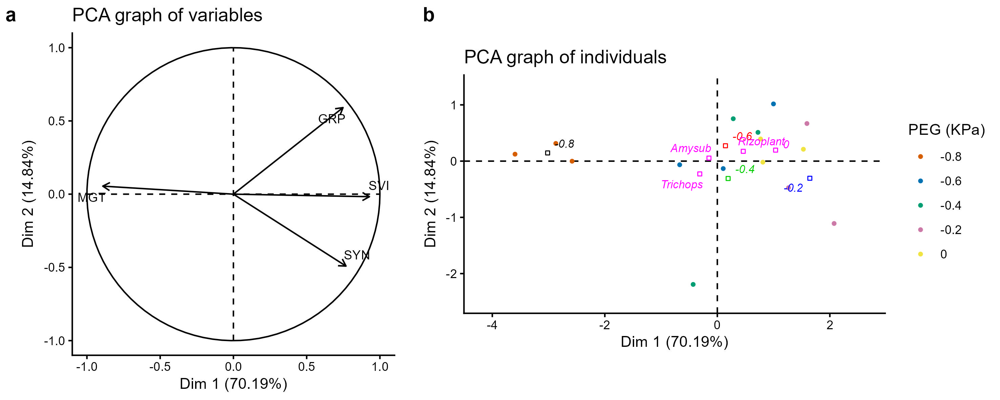

# Project Setup

```{r}
#| label:  setup
library(corrplot)
library(FSA)
library(agricolae)
library(factoextra)
library(GerminaR)
library(lubridate)
library(RColorBrewer)
source("https://inkaverse.com/setup.r")
```

# Data import

```{r}
gs <- "https://docs.google.com/spreadsheets/d/1GgfIOmTGyvjtuVQzJgFA8ueD1yqRh7x7gyueLdQVd90/edit?usp=sharing" %>%
  as_sheets_id()

germination <- gs %>%
  range_read(ss = ., sheet = "STable2") %>%
  mutate(across(1:9, as.factor)) %>%
  mutate(peg = factor(peg, levels = c("-0.8", "-0.6", "-0.4", "-0.2", "0")))

glimpse(germination)

inoculation <- gs %>%
  range_read(ss = ., sheet = "STable3") %>%
  mutate(across(1:6, ~ as.factor(.)))

glimpse(inoculation)

climate <- gs %>%
  range_read(ss = ., sheet = "STable1") %>%
  mutate(across(1:2, ~ as.factor(.)))

glimpse(climate)
```

# Data summary

Summary of the number of data points recorded for each treatment and evaluated variable.

```{r}
sm <- germination %>%
  group_by(Inoculant) %>%
  summarise(across(starts_with("ger"), ~ sum(!is.na(.))))

sm %>% kable(align = "c")

sm <- inoculation %>%
  group_by(Site, treat) %>%
  summarise(across(pl_height:yield, ~ sum(!is.na(.))))

sm %>% kable(align = "c")
```

# Materials & Methods

## Meteorological data

```{r}
met <- range_read(ss = gs, sheet = "STable1") %>%
  mutate(date = as_date(fecha))

scale1 <- 2

scale2 <- 2

met_lamud <- met %>%
  filter(site == "Lamud")

met_molino <- met %>% filter(site == "Molinopampa")

plot_1 <- met_lamud %>%
  ggplot(aes(x = fecha)) +
  geom_line(aes(y = tmax, color = "Tmax (°C)"), size = 0.8, linetype = "longdash") +
  geom_line(aes(y = tmin, color = "Tmin (°C)"), size = 0.8, linetype = "dotted") +
  geom_bar(aes(y = pp / scale1),
    stat = "identity", size = .1, fill = "blue", color = "black", alpha = .4
  ) +
  geom_line(aes(y = humrel / scale1, color = "HR (%)"), size = 0.8, linetype = "twodash") +
  scale_color_manual("", values = c("skyblue", "red", "blue")) +
  scale_y_continuous(
    limits = c(0, 50),
    expand = c(0, 0),
    name = "Temperature (°C)",
    sec.axis = sec_axis(~ . * scale1, name = "Precipitation (mm)")
  ) +
  scale_x_date(date_breaks = "7 day", date_labels = "%d-%b", name = NULL) +
  theme_minimal_grid() +
  theme(legend.position = "top") +
  theme(axis.text.x = element_text(angle = 45, hjust = 1))


plot_2 <- met_molino %>%
  ggplot(aes(x = fecha)) +
  geom_line(aes(y = tmax, color = "Tmax (°C)"), size = 0.8, linetype = "longdash") +
  geom_line(aes(y = tmin, color = "Tmin (°C)"), size = 0.8, linetype = "dotted") +
  geom_bar(aes(y = pp / scale2),
    stat = "identity", size = .1, fill = "blue", color = "black", alpha = .4
  ) +
  geom_line(aes(y = humrel / scale2, color = "HR (%)"), size = 0.8, linetype = "twodash") +
  scale_color_manual("", values = c("skyblue", "red", "blue")) +
  scale_y_continuous(
    limits = c(0, 50),
    expand = c(0, 0),
    name = "Temperature (°C)",
    sec.axis = sec_axis(~ . * scale2, name = "Precipitation (mm)")
  ) +
  scale_x_date(date_breaks = "7 day", date_labels = "%d-%b", name = NULL) +
  theme_minimal_grid() +
  theme(legend.position = "top") +
  theme(axis.text.x = element_text(angle = 45, hjust = 1))

legend <- cowplot::get_plot_component(plot_1, "guide-box-top", return_all = TRUE)

plot <- list(
  plot_1 + theme(
    legend.position = "none"
  ),
  plot_2 + theme(legend.position = "none")
) %>%
  plot_grid(
    plotlist = ., ncol = 1,
    labels = "auto",
    rel_heights = c(1, 1)
  )

plots <- plot_grid(legend, plot, ncol = 1, align = "v", rel_heights = c(0.05, 1))


pp <- plots %>%
  ggsave2(
    plot = ., "submission/Figure_2.jpg", units = "cm",
    width = 25, height = 25
  )

knitr::include_graphics(pp)
```

# Research Objective

## RO 1

To evaluate the effects of bio-inoculation and PEG 6000 stress on pea seed biomass, weight, and germination on pea crop.

### Germination (%)

#### Performe ten germination indices

```{r}
# germination analysis (ten variables)

gsm <- germination %>%
  ger_summary(
    factors = c("Inoculant", "peg", "block"),
    SeedN = "seeds",
    evalName = "ger_",
    data = .,
    cumulative = T
  )

# Pea data set processed

gsm %>%
  kable(label = "Germination indices")
```

#### Germination Percentage (GRP)

```{r}
# analysis of variance

av <- lmer(grp ~ 0 + (1 | block) + Inoculant * peg, data = gsm)

Anova(av, type = 3, test.statistic = "F")

mc1 <- emmeans(av, ~ Inoculant | peg) %>%
  cld(Letters = letters, reversed = T) %>%
  mutate(across(".group", ~ trimws(.))) %>%
  rename(sig1 = ".group")

mc2 <- emmeans(av, ~ peg | Inoculant) %>%
  cld(Letters = letters, reversed = T) %>%
  mutate(across(".group", ~ trimws(.))) %>%
  mutate(across(".group", ~ toupper(.))) %>%
  rename(sig2 = ".group")

mc <- merge(mc2, mc1) %>%
  unite(col = "group", c("sig1", "sig2"), sep = "") %>%
  mutate(peg = factor(peg, levels = c("-0.8", "-0.6", "-0.4", "-0.2", "0")))

mc %>% kable(caption = "Germination percentage mean comparision")

grp <- mc %>%
  fplot(
    data = .,
    type = "bar",
    x = "peg",
    y = "emmean",
    group = "Inoculant",
    ylimits = c(0, 140, 20),
    ylab = "Germination ('%')",
    xlab = "PEG (MPa)",
    glab = "Inoculant",
    error = "SE",
    sig = "group",
    color = T
  )

grp
```

#### Mean Germination Time (MGT)

```{r}
# analysis of variance

av <- lmer(mgt ~ 0 + (1 | block) + Inoculant * peg, data = gsm)

Anova(av, type = 3, test.statistic = "F")

mc1 <- emmeans(av, ~ Inoculant | peg) %>%
  cld(Letters = letters, reversed = T) %>%
  mutate(across(".group", ~ trimws(.))) %>%
  rename(sig1 = ".group")

mc2 <- emmeans(av, ~ peg | Inoculant) %>%
  cld(Letters = letters, reversed = T) %>%
  mutate(across(".group", ~ trimws(.))) %>%
  mutate(across(".group", ~ toupper(.))) %>%
  rename(sig2 = ".group")

mc <- merge(mc2, mc1) %>%
  unite(col = "group", c("sig1", "sig2"), sep = "") %>%
  mutate(peg = factor(peg, levels = c("-0.8", "-0.6", "-0.4", "-0.2", "0")))

mc %>% kable(caption = "Mean Germination Time comparision")

mgt <- mc %>%
  fplot(
    data = .,
    type = "bar",
    x = "peg",
    y = "emmean",
    group = "Inoculant",
    ylimits = c(0, 4, 1),
    ylab = "Mean germination time (days)",
    xlab = "PEG (MPa)",
    glab = "Inoculant",
    error = "SE",
    sig = "group",
    color = T
  )

mgt
```

#### Synchronization Index (SYN)

```{r}
# analysis of variance

av <- lmer(syn ~ 0 + (1 | block) + Inoculant * peg, data = gsm)

Anova(av, type = 3, test.statistic = "F")

mc1 <- emmeans(av, ~ Inoculant | peg) %>%
  cld(Letters = letters, reversed = T) %>%
  mutate(across(".group", ~ trimws(.))) %>%
  rename(sig1 = ".group")

mc2 <- emmeans(av, ~ peg | Inoculant) %>%
  cld(Letters = letters, reversed = T) %>%
  mutate(across(".group", ~ trimws(.))) %>%
  mutate(across(".group", ~ toupper(.))) %>%
  rename(sig2 = ".group")

mc <- merge(mc2, mc1) %>%
  unite(col = "group", c("sig1", "sig2"), sep = "") %>%
  mutate(peg = factor(peg, levels = c("-0.8", "-0.6", "-0.4", "-0.2", "0")))

mc %>% kable(caption = "Synchronization Index mean comparision")

syn <- mc %>%
  fplot(
    data = .,
    type = "bar",
    x = "peg",
    y = "emmean",
    group = "Inoculant",
    ylimits = c(0, 1.5, 0.5),
    ylab = "Synchronization Index",
    xlab = "PEG (MPa)",
    glab = "Inoculant",
    error = "SE",
    sig = "group",
    color = T
  )

syn
```

#### Seedling vigor index (SVI)

```{r}
# analysis of variance

weight_res <- germination %>%
  group_by(Inoculant, peg, block) %>%
  summarise(weight = mean(peso, na.rm = TRUE), .groups = "drop")

gsm2 <- gsm %>%
  left_join(weight_res, by = c("Inoculant", "peg", "block")) %>%
  mutate(svi = weight * grp / 100) %>%
  mutate(across(where(is.numeric), ~ round(., 2)))

av <- lmer(svi ~ 0 + (1 | block) + Inoculant * peg, data = gsm2)

Anova(av, type = 3, test.statistic = "F")

mc1 <- emmeans(av, ~ Inoculant | peg) %>%
  cld(Letters = letters, reversed = T) %>%
  mutate(across(".group", ~ trimws(.))) %>%
  rename(sig1 = ".group")

mc2 <- emmeans(av, ~ peg | Inoculant) %>%
  cld(Letters = letters, reversed = T) %>%
  mutate(across(".group", ~ trimws(.))) %>%
  mutate(across(".group", ~ toupper(.))) %>%
  rename(sig2 = ".group")

mc <- merge(mc2, mc1) %>%
  unite(col = "group", c("sig1", "sig2"), sep = "") %>%
  mutate(peg = factor(peg, levels = c("-0.8", "-0.6", "-0.4", "-0.2", "0")))

mc %>% kable(caption = "Seedling vigor index mean comparision")

svi <- mc %>%
  fplot(
    data = .,
    type = "bar",
    x = "peg",
    y = "emmean",
    group = "Inoculant",
    ylimits = c(0, 8, 2),
    ylab = "Seedling vigor index",
    xlab = "PEG (MPa)",
    glab = "Inoculant",
    error = "SE",
    sig = "group",
    color = T
  )

svi
```


```{r}
legend <- cowplot::get_plot_component(grp, "guide-box-top", return_all = TRUE)

plot2 <- list(
  grp + theme(
    legend.position = "none",
    axis.title.x = element_blank(),
    axis.text.x = element_blank(),
    axis.ticks.x = element_blank()
  ),
  mgt + theme(
    legend.position = "none",
    axis.title.x = element_blank(),
    axis.text.x = element_blank(),
    axis.ticks.x = element_blank()
  ),
  syn + theme(legend.position = "none"),
  svi + theme(legend.position = "none")
) %>%
  plot_grid(
    plotlist = ., ncol = 2,
    labels = "auto",
    rel_heights = c(1, 1)
  )

fig2 <- plot_grid(legend, plot2, ncol = 1, align = "v", rel_heights = c(0.05, 1))

pp <- fig2 %>%
  ggsave2(
    plot = ., "submission/Figure_3.jpg",
    units = "cm",
    width = 24,
    height = 16
  )

knitr::include_graphics(pp)
```

#### Multivariate germination analysis

```{r}
mv <- gsm2 %>%
  group_by(Inoculant, peg) %>%
  dplyr::select(grp, mgt, syn, svi) %>%
  summarise(
    across(
      where(is.numeric),
      ~ mean(.x, na.rm = TRUE),
      .names = "{toupper(.col)}"
    )
  ) 

pca <- mv %>%
  PCA(scale.unit = T, quali.sup = c(1, 2), graph = F)

# summary

pcainfo <- factoextra::get_pca(pca)

sink("files/pca_ger.txt")
cat("\nPrincipal Component Analysis Results\n")
summary(pca, nbelements = Inf, nb.dec = 2)
cat("\nCorrelations between variables and dimensions\n")
pca$cor
cat("\nContributions of the variables\n")
pca$contrib
sink()

f3a <- plot.PCA(
  x = pca, choix = "var",
  cex = 0.8,
  label = "var"
)

f3b <- plot.PCA(pca,
  choix = c("ind"),
  habillage = 2,
  cex = 0.5,
  label = "quali"
  # , invisible = "quali"
) +
  labs(color = "PEG (KPa)")
```

```{r}
fig <- list(f3a, f3b) %>%
  plot_grid(
    plotlist = ., ncol = 2, nrow = 1,
    labels = "auto",
    rel_widths = c(1, 1.4)
  )

pp <- fig %>%
  ggsave2(
    plot = ., "submission/Figure_4.jpg", units = "cm",
    width = 25, height = 10
  )


```

#### Correlation

```{r}
# ===============================
# 1. Variables de interés
# ===============================
vars_eval <- c(
  "pl_height",
  "days_flower",
  "pod_weight",
  "pod_n",
  "yield"
)

# ===============================
# 2. Crear data frames por sitio
# ===============================
df_Lamud <- inoculation %>%
  dplyr::filter(Site == "Lamud") %>%
  dplyr::rename_with(~ paste0("Lamud_", .x), all_of(vars_eval))

df_Molinopampa <- inoculation %>%
  dplyr::filter(Site == "Molinopampa") %>%
  dplyr::rename_with(~ paste0("Molinopampa_", .x), all_of(vars_eval))

# ===============================
# 3. Unir ambos sitios en formato ancho
# ===============================
df_wide <- df_Lamud %>%
  dplyr::select(-Site) %>%
  dplyr::left_join(
    df_Molinopampa %>% dplyr::select(-Site),
    by = c("block", "Inoculant", "Fertilization", "treat", "row")
  ) %>%
  dplyr::select(
    starts_with("Lamud_"),
    starts_with("Molinopampa_")
  )

# ===============================
# 4. Renombrar variables (abreviaturas)
# ===============================
cn <- colnames(df_wide)

cn <- gsub("pl_height",   "PH",    cn)
cn <- gsub("days_flower", "FD",    cn)
cn <- gsub("pod_weight",  "PW",    cn)
cn <- gsub("pod_n",       "PN",    cn)
cn <- gsub("yield",       "Yield", cn)

colnames(df_wide) <- cn

# ===============================
# 5. Matriz de correlación
# ===============================
cor_matrix <- cor(
  df_wide,
  use = "pairwise.complete.obs"
)

# ===============================
# 6. Paleta de colores
# ===============================
col_pal <- colorRampPalette(
  rev(RColorBrewer::brewer.pal(11, "RdBu"))
)(200)

# ===============================
# 7. Guardar figura (JPG)
# ===============================
jpeg(
  filename = "submission/ESM2.jpg",
  width = 3000,
  height = 2200,
  res = 300,
  quality = 100
)

corrplot::corrplot(
  cor_matrix,
  method = "color",
  type = "upper",
  order = "hclust",
  col = col_pal,
  addCoef.col = "black",
  number.cex = 0.7,
  tl.col = "black",
  tl.cex = 0.8,
  tl.srt = 45,
  diag = FALSE,
  cl.cex = 0.8
)

dev.off()
```

## RO 2

To demonstrate the combined effects of bio-inoculation and fertilization on field experiment on pea crop.

### Plant Height

```{r}
# analysis of variance

av <- lmer(pl_height ~ 0 + (1 | block) + Inoculant * Fertilization + Site, data = inoculation)

Anova(av, type = 3, test.statistic = "F")

mc1 <- emmeans(av, ~ Site | Inoculant | Fertilization) %>%
  cld(Letters = letters, reversed = T) %>%
  mutate(across(".group", ~ trimws(.))) %>%
  rename(sig1 = ".group")

mc2 <- emmeans(av, ~ Site | Fertilization | Inoculant) %>%
  cld(Letters = letters, reversed = T) %>%
  mutate(across(".group", ~ trimws(.))) %>%
  mutate(across(".group", ~ toupper(.))) %>%
  rename(sig2 = ".group")

mc_ph <- merge(mc2, mc1) %>%
  unite(col = "group", c("sig1", "sig2"), sep = "") %>%
  mutate(Inoculant = factor(Inoculant, levels = c("Control", "Amysub", "Rizoplant", "Trichops")))

mc_ph <- na.omit(mc_ph)

mc_ph %>% kable(caption = "Plant Height mean comparision")

# p1 <- mc %>%
#   plot_smr(
#     data = .,
#     type = "bar",
#     x = "Inoculant",
#     y = "emmean",
#     group = "Fertilization",
#     ylimits = c(0, 140, 20),
#     ylab = "Plant height (cm)",
#     xlab = "Inoculant",
#     glab = "Dose",
#     error = "SE",
#     sig = "group",
#     color = T
#   ) +
#   facet_wrap(~Site)
# 
# p1
```

### Flowering

```{r}
# analysis of variance

av <- lmer(days_flower ~ 0 + (1 | block) + Inoculant * Fertilization + Site, data = inoculation)

Anova(av, type = 3, test.statistic = "F")

mc1 <- emmeans(av, ~ Site | Inoculant | Fertilization) %>%
  cld(Letters = letters, reversed = T) %>%
  mutate(across(".group", ~ trimws(.))) %>%
  rename(sig1 = ".group")

mc2 <- emmeans(av, ~ Site | Fertilization | Inoculant) %>%
  cld(Letters = letters, reversed = T) %>%
  mutate(across(".group", ~ trimws(.))) %>%
  mutate(across(".group", ~ toupper(.))) %>%
  rename(sig2 = ".group")

mc_fd <- merge(mc2, mc1) %>%
  unite(col = "group", c("sig1", "sig2"), sep = "") %>%
  mutate(Inoculant = factor(Inoculant, levels = c("Control", "Amysub", "Rizoplant", "Trichops")))

mc_fd <- na.omit(mc_fd)

mc_fd %>% kable(caption = "Flowering mean comparision")

# p2 <- mc %>%
#   plot_smr(
#     data = .,
#     type = "bar",
#     x = "Inoculant",
#     y = "emmean",
#     group = "Fertilization",
#     ylimits = c(0, 100, 20),
#     ylab = "Flowering (days)",
#     xlab = "Inoculant",
#     glab = "Dose",
#     error = "SE",
#     sig = "group",
#     color = T
#   ) +
#   facet_wrap(~Site)
# 
# p2
```

### Pod weight

```{r}
# analysis of variance

av <- lmer(pod_weight ~ 0 + (1 | block) + Inoculant * Fertilization + Site, data = inoculation)

Anova(av, type = 3, test.statistic = "F")

mc1 <- emmeans(av, ~ Site | Inoculant | Fertilization) %>%
  cld(Letters = letters, reversed = T) %>%
  mutate(across(".group", ~ trimws(.))) %>%
  rename(sig1 = ".group")

mc2 <- emmeans(av, ~ Site | Fertilization | Inoculant) %>%
  cld(Letters = letters, reversed = T) %>%
  mutate(across(".group", ~ trimws(.))) %>%
  mutate(across(".group", ~ toupper(.))) %>%
  rename(sig2 = ".group")

mc_pw <- merge(mc2, mc1) %>%
  unite(col = "group", c("sig1", "sig2"), sep = "") %>%
  mutate(Inoculant = factor(Inoculant, levels = c("Control", "Amysub", "Rizoplant", "Trichops")))

mc_pw <- na.omit(mc_pw)

mc_pw %>% kable(caption = "Pod weight mean comparision")

# p3 <- mc %>%
#   plot_smr(
#     data = .,
#     type = "bar",
#     x = "Inoculant",
#     y = "emmean",
#     group = "Fertilization",
#     ylimits = c(0, 100, 20),
#     ylab = "Pod weight (g)",
#     xlab = "Inoculant",
#     glab = "Dose",
#     error = "SE",
#     sig = "group",
#     color = T
#   ) +
#   facet_wrap(~Site)
# 
# p3
```

### Pods per plant

```{r}
# analysis of variance

av <- lmer(pod_n ~ 0 + (1 | block) + Inoculant * Fertilization + Site, data = inoculation)

Anova(av, type = 3, test.statistic = "F")

mc1 <- emmeans(av, ~ Site | Inoculant | Fertilization) %>%
  cld(Letters = letters, reversed = T) %>%
  mutate(across(".group", ~ trimws(.))) %>%
  rename(sig1 = ".group")

mc2 <- emmeans(av, ~ Site | Fertilization | Inoculant) %>%
  cld(Letters = letters, reversed = T) %>%
  mutate(across(".group", ~ trimws(.))) %>%
  mutate(across(".group", ~ toupper(.))) %>%
  rename(sig2 = ".group")

mc_pn <- merge(mc2, mc1) %>%
  unite(col = "group", c("sig1", "sig2"), sep = "") %>%
  mutate(Inoculant = factor(Inoculant, levels = c("Control", "Amysub", "Rizoplant", "Trichops")))

mc_pn <- na.omit(mc_pn)

mc_pn %>% kable(caption = "Pod weight mean comparision")

# p4 <- mc %>%
#   plot_smr(
#     data = .,
#     type = "bar",
#     x = "Inoculant",
#     y = "emmean",
#     group = "Fertilization",
#     ylimits = c(0, 20, 5),
#     ylab = "Pods (pods/plants)",
#     xlab = "Inoculant",
#     glab = "Dose",
#     error = "SE",
#     sig = "group",
#     color = T
#   ) +
#   facet_wrap(~Site)
# 
# p4
```

### Yield

```{r}
# analysis of variance

av <- lmer(yield ~ 0 + (1 | block) + Inoculant * Fertilization + Site, data = inoculation)

Anova(av, type = 3, test.statistic = "F")

mc1 <- emmeans(av, ~ Site | Inoculant | Fertilization) %>%
  cld(Letters = letters, reversed = T) %>%
  mutate(across(".group", ~ trimws(.))) %>%
  rename(sig1 = ".group")

mc2 <- emmeans(av, ~ Site | Fertilization | Inoculant) %>%
  cld(Letters = letters, reversed = T) %>%
  mutate(across(".group", ~ trimws(.))) %>%
  mutate(across(".group", ~ toupper(.))) %>%
  rename(sig2 = ".group")

mc_yd <- merge(mc2, mc1) %>%
  unite(col = "group", c("sig1", "sig2"), sep = "") %>%
  mutate(Inoculant = factor(Inoculant, levels = c("Control", "Amysub", "Rizoplant", "Trichops")))

mc_yd <- na.omit(mc_yd)

mc_yd %>% kable(caption = "Yield mean comparision")

# p5 <- mc %>%
#   plot_smr(
#     data = .,
#     type = "bar",
#     x = "Inoculant",
#     y = "emmean",
#     group = "Fertilization"
#     # , ylimits = c(0, 200, 50)
#     , ylab = "Yield (kg/ha)",
#     xlab = "Inoculant",
#     glab = "Dose",
#     error = "SE",
#     sig = "group",
#     color = T
#   ) +
#   facet_wrap(~Site) +
#   theme(axis.text.y = element_text(angle = 90, vjust = 0.5))
# 
# p5
```

### Table 1

Descriptive statistics of the variables that determine the effects of bio-inoculation and fertilization on field experiment on pea crop.

```{r}
format_emm <- function(df) {
  df %>%
    dplyr::mutate(
      value = sprintf("%.2f ± %.2f %s", emmean, SE, group)
    ) %>%
    dplyr::select(Site, Inoculant, Fertilization, value)
}

mc_list <- list(
  ph = mc_ph,
  fd = mc_fd,
  pw = mc_pw,
  pn = mc_pn,
  yd = mc_yd
)

mc_list <- map(mc_list, format_emm)

colnames(mc_list$ph)[4] <- "Plant height (cm)"
colnames(mc_list$fd)[4] <- "Flowering (days)"
colnames(mc_list$pw)[4] <- "Pod weight (g)"
colnames(mc_list$pn)[4] <- "Pods per plant"
colnames(mc_list$yd)[4] <- "Yield (kg ha-1)"

final_table <- mc_list$ph %>%
  left_join(mc_list$fd, by = c("Site", "Inoculant", "Fertilization")) %>%
  left_join(mc_list$pw, by = c("Site", "Inoculant", "Fertilization")) %>%
  left_join(mc_list$pn, by = c("Site", "Inoculant", "Fertilization")) %>%
  left_join(mc_list$yd, by = c("Site", "Inoculant", "Fertilization"))

final_table %>% kable(align = "c")

final_table %>%
  write_sheet(ss = gs, sheet = "tb1")
```

#### Multivariate

```{r}
mv <- inoculation %>%
  group_by(Inoculant, Fertilization) %>%
  dplyr::select(pl_height, days_flower, pod_weight, pod_n, yield) %>%
  summarise(across(where(is.numeric), ~ mean(., na.rm = T))) %>%
  unite("treat", Inoculant:Fertilization, sep = "-") %>%
  rename(
    PH = pl_height,
    FD = days_flower,
    PW = pod_weight,
    PN = pod_n,
    Yield = yield
  )

pca <- mv %>%
  PCA(scale.unit = T, quali.sup = 1, graph = F)

# summary

pcainfo <- factoextra::get_pca(pca)

sink("files/pca_field.txt")
cat("\nPrincipal Component Analysis Results\n")
summary(pca, nbelements = Inf, nb.dec = 2)
cat("\nCorrelations between variables and dimensions\n")
pca$cor
cat("\nContributions of the variables\n")
pca$contrib
sink()

f6a <- plot.PCA(
  x = pca, choix = "var",
  cex = 0.8,
  label = "var"
)

f6b <- plot.PCA(
  x = pca, choix = "ind",
  habillage = 1,
  invisible = c("ind"),
  cex = 0.8,
  ylim = c(-3, 3),
  xlim = c(-4, 4)
)
```

#### Figure 6

Principal Component Analysis (PCA).

```{r}
fig <- list(f6a, f6b) %>%
  plot_grid(
    plotlist = ., ncol = 2, nrow = 1,
    labels = "auto",
    rel_widths = c(1, 1.3)
  )

pp <- fig %>%
  ggsave2(
    plot = ., "submission/Figure_6.jpg", units = "cm",
    width = 25, height = 10
  )

knitr::include_graphics(pp)
```

# References

Broman, K. W., & Woo, K. H. (2017). Data organization in spreadsheets. The American Statistician, 72(1), 2–10. https://doi.org/10.1080/00031305.2017.1375989

Zuur, A. F., Ieno, E. N., & Elphick, C. S. (2009). A protocol for data exploration to avoid common statistical problems. Methods in Ecology and Evolution, 1(1), 3–14. https://doi.org/10.1111/j.2041-210x.2009.00001.x

Francoishusson. (2017, July 13). PCA course using FactoMineR | R-bloggers. R-bloggers. https://www.r-bloggers.com/2017/07/pca-course-using-factominer/

Kozak, M., & Piepho, H. (2017). What’s normal anyway? Residual plots are more telling than significance tests when checking ANOVA assumptions. Journal of Agronomy and Crop Science, 204(1), 86–98. https://doi.org/10.1111/jac.12220

Tanaka, E., & Hui, F. K. C. (2019). Symbolic formulae for linear mixed models. In Communications in computer and information science (pp. 3–21). https://doi.org/10.1007/978-981-15-1960-4_1

Schielzeth, H., Dingemanse, N. J., Nakagawa, S., Westneat, D. F., Allegue, H., Teplitsky, C., Réale, D., Dochtermann, N. A., Garamszegi, L. Z., & Araya‐Ajoy, Y. G. (2020). Robustness of linear mixed‐effects models to violations of distributional assumptions. Methods in Ecology and Evolution, 11(9), 1141–1152. https://doi.org/10.1111/2041-210x.13434
