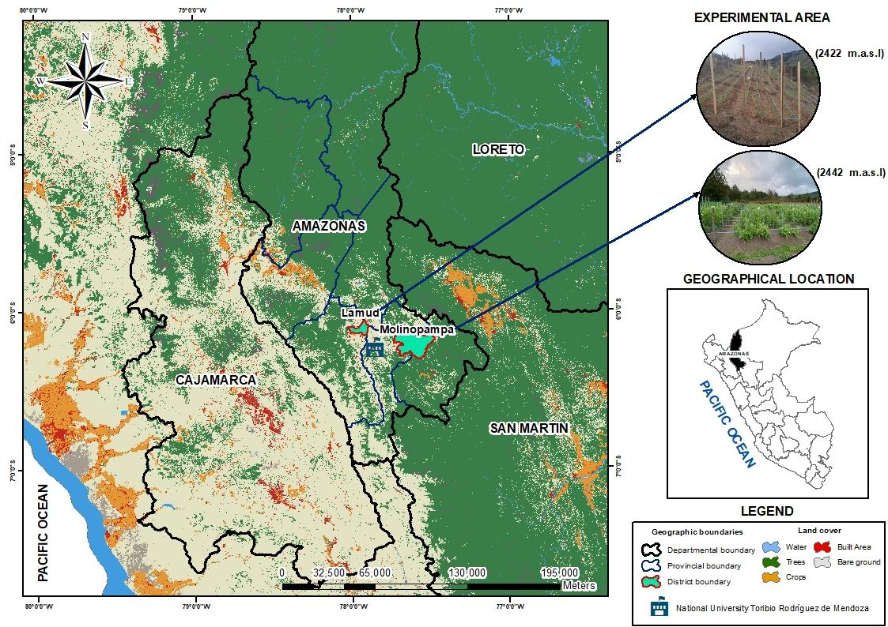

**Microbial Bio-inoculation Effects on Seed Germination Dynamics and Field Performance of Pea (*Pisum sativum* L.) under Osmotic Stress and Fertilization**

Francisco Guevara-Fernández^1\*^; Sebastian Casas-Niño^2^; Milagros Ninoska Munoz-Salas^3^; Wagner Meza-Maicelo^1,4,5^;  Manuel Oliva-Cruz^1,4^;  Flavio Lozano-Isla^1,4,5\*^.

^1^ Instituto de Investigación para el Desarrollo Sustentable de Ceja de Selva (INDES-CES), Universidad Nacional Toribio Rodríguez de Mendoza de Amazonas (UNTRM), Chachapoyas - Amazonas 01001, Perú.

^2^ Dirección de Servicios Estratégicos Agrarios - Estación Experimental Agraria El Chira, Instituto Nacional de Innovación Agraria (INIA), Piura 20120, Perú.

^3^ Department of Earth and Environment, Institute of Environment, Florida International University, Miami, FL 33199, USA 

^4^ Facultad de Ingeniería y Ciencias Agrarias, Universidad Nacional Toribio Rodríguez de Mendoza de Amazonas (UNTRM), Chachapoyas - Amazonas 01001, Perú.

^5^ Centro de Investigación e Innovación en Granos y Semillas, Universidad Nacional Toribio Rodríguez de Mendoza de Amazonas (UNTRM), Chachapoyas - Amazonas 01001, Perú.

* ^\*^ *Corresponding author: [flavio.lozano@untrm.edu.pe](mailto:flavio.lozano@untrm.edu.pe) 


| **Author**                       | **ORCID**                        | **email**                         |
|----------------------------------|----------------------------------|-----------------------------------|
| **Francisco Guevara-Fernández**  | 0000-0002-9967-6590              | elen.guevara@untrm.edu.pe         |
| **Sebastian Casas-Niño**         | 0000-0002-6576-8761              | 20140231@lamolina.edu.pe          |
| **Milagros Ninoska Munoz-Salas** | 0009-0001-7278-5690              | mmuno126@fiu.edu                  |
| **Wagner Meza Maicelo**          | 0009-0003-3556-3866              | wagner.meza.epg@untrm.edu.pe      |
| **Manuel Oliva-Cruz**            | 0000-0002-9670-0970              | manuel.oliva@untrm.edu.pe         |
| **Flavio Lozano-Isla**           | 0000-0002-0714-669X              | flavio.lozano@untrm.edu.pe        |


**ABSTRACT**

Microbial bio-inoculants have been proposed as management tools to enhance crop performance under variable environmental conditions; however, their effectiveness is frequently modulated by site-specific factors. This study evaluated the effects of bio-inoculation on seed germination and seedling vigor of pea under osmotic stress induced by polyethylene glycol (PEG 6000), and assessed the interaction between bio-inoculation and two fertilization levels under field conditions in the Amazonas region of Peru. Under laboratory conditions, germination percentage remained high across all treatments (93.3–100%) and was not affected by bio-inoculation or osmotic potential. In contrast, osmotic stress significantly altered germination dynamics. Mean germination time increased from 1.85–2.09 days at 0 MPa to 2.26–2.43 days at −0.8 MPa, while germination synchrony and seedling vigor declined with increasing stress. The seedling vigor index reached maximum values at −0.2 MPa (4.47–5.29) and decreased at −0.8 MPa (1.50–2.00). Multivariate analyses indicated that variation in germination responses was mainly associated with germination timing and vigor rather than seed viability. Field experiments revealed variability in agronomic traits between locations. Plant height ranged from 38.5–46.3 cm in Lamud and from 100.6–108.3 cm in Molinopampa, while grain yield varied from 698–1846 kg/ha and 8771–9919 kg/ha, respectively. Yield variation was explained by pod weight and number of pods per plant. Environmental conditions showed a stronger influence than microbial bio-inoculation on germination dynamics and field productivity, although positive trends associated with bio-inoculant application were observed.

**Keywords:** abiotic stress; andean-amazonian region; germination indices; multilocation trial; plant growth-promoting bacteria

# **INTRODUCTION**

Pea (*Pisum sativum* L.) is one of the most widely cultivated cool-season grain legumes, valued for its high protein content, contribution to human nutrition, and capacity to enhance soil fertility through biological nitrogen fixation [(Pandey et al., 2021; Sarkar et al., 2021)](https://www.zotero.org/google-docs/?Vv36Fb). Globally, peas rank among one of the most important pulse crops and are widely integrated into sustainable cropping systems due to their relatively low input requirements and compatibility with cereal-based rotations [(Tulbek et al., 2024)](https://www.zotero.org/google-docs/?0QpVaS). In developing regions, including the Andean and Amazonian zones of South America, pea production plays a key role in food security and smallholder livelihoods, yet yields remain highly vulnerable to environmental stressors and suboptimal nutrient management [(Gavilan‐Figari et al., 2024)](https://www.zotero.org/google-docs/?awNn6G).

Among abiotic constraints, water limitation is one of the most critical factors affecting legume establishment, early seedling growth, and final yield [(Bagheri et al., 2023; Jacques et al., 2023; Tamindžić et al., 2024; Zeleke & Nendel, 2019)](https://www.zotero.org/google-docs/?hsJ3Wq). Climate change projections indicate an increasing frequency and intensity of drought events, particularly in rainfed agricultural systems, thereby exacerbating climatic risk during sensitive phenological stages such as germination and early vegetative development [(Dave et al., 2024; Rascón et al., 2021)](https://www.zotero.org/google-docs/?0XzuSs). In peas and other legumes, drought stress impairs germination kinetics and delays seedling emergence, reduces biomass accumulation, and ultimately limits yield formation through constraints on water uptake and early growth processes, while concurrently restricting enzymatic activity, carbon assimilation, and overall photosynthetic efficiency [(Iqbal et al., 2025; Sarkar et al., 2021)](https://www.zotero.org/google-docs/?OQCcZd). Controlled osmotic stress induced by polyethylene glycol (PEG) has therefore been widely adopted as a reliable experimental approach to simulate drought conditions during germination, allowing precise assessment of seed physiological responses under reduced water potential (cita)

In parallel with water availability, nutrient management – particularly nitrogen fertilization – remains a major determinant of pea productivity. Although peas possess symbiotic nitrogen-fixing capacity, mineral nitrogen inputs are often required to support early growth and maximize yield, especially under stress conditions or in soils with limited biological activity [(Pandey et al., 2021)](https://www.zotero.org/google-docs/?t5L240). However, excessive fertilization increases production costs and environmental impacts, while drought conditions can further reduce nutrient use efficiency by limiting root activity and nutrient uptake. Consequently, strategies that improve plant resilience while reducing dependence on full fertilizer doses are increasingly prioritized in sustainable legume production systems.

Another major limitation in pea-based systems is the continued reliance on synthetic fertilizers. Although mineral nitrogen (N) and phosphorus (P) inputs can enhance productivity, excessive fertilizer use contributes to soil acidification, nutrient imbalances, and negative environmental externalities, including eutrophication and greenhouse gas emissions [(Abay et al., 2025; Gao & Cabrera Serrenho, 2023)](https://www.zotero.org/google-docs/?gKcD65). Sustainable intensification therefore requires management practices that improve nutrient-use efficiency while enabling partial substitution of chemical fertilizers without yield penalties. In this context, bio-inoculation with plant growth-promoting microorganisms (PGPM), including *Bacillus, Azospirillum,* and *Trichoderma* spp. has emerged as a promising strategy [(Dhawi, 2023; El-Saadony et al., 2024; Figiel et al., 2025)](https://www.zotero.org/google-docs/?nAGDCo). These microorganisms promote crop growth through multiple mechanisms, such as phytohormone production, biological nitrogen fixation, nutrient solubilization, and stress mitigation mediated by 1-aminocyclopropane-1-carboxylate (ACC) deaminase activity and improved osmotic adjustment [(Chieb & Gachomo, 2023; Ferreira et al., 2025)](https://www.zotero.org/google-docs/?q6dbI9).

Recent studies indicate that co-application of microbial inoculants with reduced fertilizer rates can sustain or even enhance legume yields while simultaneously improving soil microbial diversity and resilience to environmental stress [(Díaz-Rodríguez, Parra Cota, et al., 2025; He et al., 2024; Ollio et al., 2025)](https://www.zotero.org/google-docs/?yWiSpe). In pea, inoculation with *Bacillus, Azospirillum,* and *Trichoderma* spp. has been associated with improvements in germination, nodulation, nutrient uptake, and stress tolerance through modulation of root architecture and enhanced rhizosphere interaction [(Pérez-Leal et al., 2025; Poveda & Eugui, 2022)](https://www.zotero.org/google-docs/?ilChpY). Beyond direct plant growth promotion, microbial inoculants contribute to soil ecological stability by stimulating beneficial microbial consortia and increasing enzyme activities linked to nitrogen and phosphorus cycling [(Krishna et al., 2024; Laishram et al., 2025)](https://www.zotero.org/google-docs/?uJXv8S). In particular, *Bacillus* spp. have been shown to alleviate drought stress through ACC deaminase activity, proline accumulation, and osmolyte production, thereby improving seedling establishment under water-limited conditions [(Eswaran et al., 2024; Mendoza-Alatorre et al., 2024)](https://www.zotero.org/google-docs/?sNFZlr). 

Despite growing evidence of microbial benefits under controlled conditions, results from field studies remain inconsistent, particularly when bio-inoculation is combined with varying fertilization regimes. While some studies report improved emergence, growth, and yield under reduced fertilizer inputs, others suggest that favorable environmental conditions may mask microbial effects, especially during germination when water availability is tightly regulated [(Dave et al., 2024; Kashyap et al., 2019)](https://www.zotero.org/google-docs/?EcXUgr).  Moreover, most studies focus either on laboratory-based germination assays or on field performance, with limited integration of both scales within a single experimental framework. This gap constrains the translation of early physiological responses into agronomically meaningful outcomes.

In the Amazonian region of Peru, where climatic variability, episodic water stress, and heterogeneous soil fertility frequently constrain legume production, integrated evaluations of bio-inoculation under both controlled and field conditions are particularly relevant. Assessing whether microbial inoculants can enhance drought resilience during early development and support yield formation under reduced fertilization offers a promising pathway toward more resilient and resource-efficient pea-based production systems.

Therefore, the objectives of this study were: (i) to evaluate the effects of bio-inoculation on pea seed germination and seedling biomass under simulated drought stress induced by PEG 6000 under controlled conditions, and (ii) to assess the interaction between bio-inoculation and two fertilization levels (75% and 100% of the recommended dose) on emergence, growth, and yield of pea under field conditions in the Amazonas region of Peru. By integrating laboratory and field experiments, this study aims to provide both mechanistic and agronomic insights into the potential of microbial inoculants to enhance stress resilience while reducing fertilizer requirements in pea production systems.

# **MATERIALS AND METHODS**

## Study Area

The study was conducted in two phases: laboratory assays for germination analysis and field trials. Laboratory experiments were carried out at the Laboratorio de Suelos y Aguas (LABISAG), Universidad Nacional Toribio Rodríguez de Mendoza de Amazonas (UNTRM), Chachapoyas, Peru. Field trials were established in two contrasting sites of the Amazonas region: Lamud (-6.1444° S, -77.9326° W; 2422 m a.s.l., Luya Province) and Molinopampa (-6.2084° S, -77.6737° W; 2442 m a.s.l., Chachapoyas Province). 


{#fig:id.ptdzwnjm57lf}

## Plant material

Seeds of pea (*Pisum sativum* L.) cultivar ‘INIA-102 Usui’ (99% varietal purity, 98% germination, 13% seed moisture) were used. This cultivar is widely cultivated in the Peruvian highlands for its yield potential, adaptability to variable environments, and disease tolerance [(Jara-Garcia & Nicho-Salas, 2023)](https://www.zotero.org/google-docs/?AiLvct). 

## Germination analysis

The germination experiment followed a randomized complete block design with two factors and three replicates. The first factor consisted of three bio-inoculant and the second factor comprised five levels of polyethylene glycol 6000 (PEG 6000) osmotic potential. Bio-inoculation treatments included three commercial products: (i) Amysub (*Bacillus subtilis* and *B. amyloliquefaciens*, ≥1 × 10⁹ CFU g⁻¹; Raúl Yaipén Lab, Lima, Peru), (ii) Rizoplant (*Azospirillum brasilense, Azotobacter* spp., *Bacillus* spp., *Trichoderma* spp., ≥2.2 × 10⁴ CFU mL⁻¹; Productos Biológicos para la Agricultura, Lima, Peru), and (iii) Trichops (*Trichoderma harzianum, T. viride, T. asperellum*, >1.5 × 10¹⁰ conidia g⁻¹; Productos Biológicos para la Agricultura, Lima, Peru) (Table 1). Drought stress was simulated with PEG 6000 solutions prepared at osmotic potentials of 0, −0.2, −0.4, −0.6, and −0.8 MPa, calculated using the Michel and Kaufmann equation [(Raveneau et al., 2011; Tyśkiewicz et al., 2022)](https://www.zotero.org/google-docs/?AmOmpw)

Seeds were surface sterilized in 70% ethanol (1 min), followed by 2% sodium hypochlorite (2 min), and rinsed four times with sterile distilled water in accordance with ISTA guidelines [(Arafa et al., 2021)](https://www.zotero.org/google-docs/?bi8QxN). All seeds were imbibed for 12 h in the respective inoculant suspensions before sowing. Seeds soaked in sterile water served as controls. 


: Commercial bio-inoculants used in the study and their active microorganisms with corresponding concentrations. {#tbl:kix.jeh0e8yt8h7r}


| **Bio-inoculant**                                 | **Active microorganism**                          | **Concentration**                                  |
|---------------------------------------------------|---------------------------------------------------|----------------------------------------------------|
| Amysub                                            | *Bacillus subtilis, B. amyloliquefaciens*         | ≥1 × 10⁹ CFU g⁻¹                                   |
| Rizoplant                                         | *Lactobacillus* spp.                              | 1.1 × 10⁵ CFU mL⁻¹                                 |
|                                                   | *Saccharomyces spp.*                              | 2.2 × 10⁴ CFU mL⁻¹                                 |
|                                                   | *Rhodopseudomonas spp.*                           | 2.3 × 10⁷ CFU mL⁻¹                                 |
|                                                   | *Streptomyces spp.*                               | 2.3 × 10⁵ CFU mL⁻¹                                 |
|                                                   | *Azotobacter spp.*                                | 3.0 × 10⁸ CFU mL⁻¹                                 |
|                                                   | *Azospirillum brasilense*                         | 6.5 × 10⁹ CFU mL⁻¹                                 |
|                                                   | *Bacillus spp.*                                   | 6.0 × 10⁷ CFU mL⁻¹                                 |
|                                                   | *Trichoderma spp.*                                | 2.5 × 10⁷ CFU mL⁻¹                                 |
| Trichops                                          | *Trichoderma harzianum, T. viride, T. asperellum* | >1.5 × 10¹⁰ conidia g⁻¹                            |


Thirty seeds per treatment were placed in sterilized plastic germination boxes (20 × 12 × 5 cm) lined with two layers of germination paper. Each box was initially moistened with 20 mL of PEG solution and replenished with 15 mL on day 3. Daily observations were made to monitor radicle emergence following the International Rules for Seed Testing [(ISTA, 2022)](https://www.zotero.org/google-docs/?4auGmq). To quantify germination performance and seed vigor, the following indices were calculated: germination percentage (%, GP), mean germination Time (days, MGT) and germination synchrony (SYN). These metrics were derived via the equations described by  [Lozano‐Isla et al., (2019)](https://www.zotero.org/google-docs/?R5SEr5) and implemented in the *GerminaR R* package [(Lozano-Isla et al., 2016)](https://www.zotero.org/google-docs/?VenRzq).

Seedling morphometric measurements were collected at the end of the germination experiment at 7 days after sowing to assess early-stage biomass accumulation and physiological performance. The seedling vigor index (SVI) was used to assess early plant development under stress conditions by combining seed germination capacity and seedling growth performance [(Zhao et al., 2021)](https://www.zotero.org/google-docs/?FUBnu7). The SVI was calculated using the formula:


$$\text{SVI}=\overline{W_r}\times\overline{GP}$$


Where $\overline{W_r}$ is the mean root weight, expressed in grams (g), and $\overline{GP}$ represents the average germination percentage of the seeds, expressed as a percentage (%).


## Field trials and management

Field experiments were conducted in two sites of the Amazonas region, Peru: Lámud, Luya Province (6.1444° S, 77.9326° W; 2422 m a.s.l.) from March–June 2024, and Molinopampa, Chachapoyas Province (6.2084° S, 77.6737° W; 2442 m a.s.l.) from June–September 2024. A randomized complete block design (RCBD) was used with three replicates per treatment. Each plot measured 8.1 m² with row spacing of 0.70 m and intra-row spacing of 0.10 m (0.05 m sowing depth). Planting density was 142,857 plants/ha. The crop was grown using a trellis system for support [(Jara-Garcia & Nicho-Salas, 2023)](https://www.zotero.org/google-docs/?rIDkfP). 

Soils differed markedly between sites, with Lámud characterized by alkaline pH and low phosphorus, and Molinopampa by acidic pH with higher phosphorus and potassium availability ([Table 2](?tab=t.0#bookmark=kix.mhy7mx7fddx2)). Lámud soils were alkaline (pH 8.38), with low phosphorus availability (3.04 mg/kg), moderate potassium (338.9 mg/kg), and relatively lower organic matter (3.99%). In contrast, Molinopampa soils were acidic (pH 5.45), with higher phosphorus (16.61 mg/kg), elevated potassium (461.2 mg/kg), and higher organic matter content (4.83%). Electrical conductivity was also greater in Molinopampa (0.34 dS/m) compared to Lámud (0.16 dS/m). Such soil variability reflects the edaphic heterogeneity typical of the Peruvian inter-Andean valleys, where fertility constraints and pH extremes can significantly influence pea productivity.

Climatic conditions during the experimental period were monitored at both sites [(NASA POWER Project, 2024)](https://www.zotero.org/google-docs/?HTTu1G). The average maximum temperature was slightly higher in Lamud (23.9 °C) compared to Molinopampa (23.7 °C). Similarly, Lamud had a slightly higher average minimum temperature (13.3 °C) than Molinopampa (13.1 °C). Relative humidity also showed a wider range in Lamud, from 40.6% to 92.3%, while in Molinopampa it ranged from 58.4% to 84.9%. Lamud received significantly more precipitation during the crop cycle (229.4 mm) than Molinopampa (46.5 mm). 

{#fig:id.vqt0zvqz1ups}


Pest control consisted of a single application of cypermethrin (*Aphis spp*. in Lámud; crickets in Molinopampa), while fungicides were avoided to prevent interference with inoculant activity. Fertilization treatments included 100% and 75% of the recommended dose (150 kg N/ha, 45.8 kg P₂O₅/ha, 120 kg K₂O/ha), applied at 20 days after planting (DAP). Fertilizers (urea and diammonium phosphate) were applied in localized holes 5–10 cm from the plants to optimize nutrient uptake and minimize losses. Crop management practices included manual weeding at 30 and 45 DAP, and hilling at 45 DAP.


: Soil parameters at the two experimental sites according to soil test reports. {#tbl:kix.durhsejzqfi9}


| **Parameter**           | **Lamud**               | **Molinopampa**          |
|-------------------------|-------------------------|--------------------------|
| pH                      | 8.38                    | 5.45                     |
| Electrical conductivity | 0.16 dS/m               | 0.34 dS/m                |
| Phosphorus              | 3.04 mg/kg              | 16.61 mg/kg              |
| Potassium               | 338.89 mg/kg            | 461.16 mg/kg             |
| Carbon content          | 2.32%                   | 2.80%                    |
| Organic matter          | 3.99%                   | 4.83%                    |
| Nitrogen                | 0.20%                   | 0.24%                    |


Evaluated variables in the first stage included germination percentage (GRP, %), mean germination time (MGT), synchronization index (SYN), and seedling vigor index (SVI); whereas in the field stage, evaluated variables encompassed days to 50% flowering (NDF), plant height at flowering (PLH, cm), number of pods per plant (PTN), average pod weight (PTW, g), and total green pod yield (YLD, kg/ha).

## Statistical analysis 

All statistical analyses and graphical outputs were performed using R software, version 4.5.2 [(R Core Team, 2025)](https://www.zotero.org/google-docs/?ylfwyF). Germination indices were calculated using the GerminaR 2.1.6 package [(Lozano-Isla et al., 2019)](https://www.zotero.org/google-docs/?r5qMmQ). A linear mixed-effects model was fitted to evaluate treatment effects, providing greater robustness to potential deviations from normality and homoscedasticity [(Schielzeth et al., 2020)](https://www.zotero.org/google-docs/?lHMqXN). Analysis of variance (ANOVA) was applied to the fitted models, and post-hoc comparisons were conducted using Tukey’s Honest Significant Difference (HSD) test at a significance level of α < 0.05, using the emmeans 2.0.0 package [(Lenth et al., 2024)](https://www.zotero.org/google-docs/?hhNs3f).

Principal component analysis (PCA) was employed to explore multivariate relationships among germination variables across different levels of PEG-induced osmotic stress, as well as among agronomic variables evaluated under different inoculant types and doses. PCA was performed using the FactoMineR 2.12 R package [(Husson et al., 2024)](https://www.zotero.org/google-docs/?DEO7H6).

# **RESULTS**

## Germination analysis

Early germination responses under osmotic stress provide a sensitive indicator of seed physiological performance and potential field establishment under water-limited conditions. Germination responses of pea seeds subjected to PEG-induced osmotic stress are presented in [Figure 3.](?tab=t.0#bookmark=id.njnuu86adppd) 

Germination percentage remained consistently high across all osmotic potentials and microbial inoculant treatments ([Figure 3a](?tab=t.0#bookmark=id.njnuu86adppd)). Mean germination values ranged from 93.3% to 100%, and neither osmotic potential nor inoculant type exerted a statistically significant effect on final germination percentage (*p* > 0.05). Mean germination time (MGT) was significantly influenced by osmotic potential (*p* < 0.05; [Figure 3b](?tab=t.0#bookmark=id.njnuu86adppd)). At the most negative water potential (−0.8 MPa), MGT ranged from 2.26 to 2.43 days, whereas progressively shorter germination times were observed as osmotic stress decreased, reaching 1.85–2.09 days at 0 MPa. Inoculant effects were not detected at −0.8 MPa; however, significant differences among microbial treatments were observed at −0.6, −0.4, −0.2, and 0 MPa. At 0 MPa, seeds treated with Trichops exhibited the shortest mean germination time (1.85 days).

The germination synchrony (SYN) increased significantly with decreasing osmotic stress (*p* < 0.05; [Figure 3c](?tab=t.0#bookmark=id.njnuu86adppd)). Values ranged from 0.50–0.58 at −0.8 MPa and increased to 0.61–0.79 at 0 MPa. Significant differences among inoculant treatments were detected at all osmotic potentials, with Trichops generally showing lower synchronization values compared with Amysub and Rizoplant. Seedling vigor index (SVI) was strongly affected by osmotic potential (*p* < 0.05; [Figure 3d](?tab=t.0#bookmark=id.njnuu86adppd)). At −0.8 MPa, SVI values ranged from 1.50 to 2.00, increasing markedly at less negative potentials and peaking at −0.2 MPa (4.47–5.29). High vigor values were maintained at 0 MPa (3.96–4.19). No statistically significant differences among inoculant treatments were detected within individual PEG levels.


![Germination indices of pea seeds bio-inoculated with different microbial treatments and subjected to PEG-induced osmotic stress (MPa). Each panel represents a germination parameter evaluated using 30 seeds per treatment: (a) germination percentage (GRP, %), (b) mean germination time (MGT, days), (c) germination synchrony (SYN), and (d) seedling vigor index (SVI). Data are presented as mean ± standard error. Uppercase letters indicate statistically significant differences among osmotic potential levels, while lowercase letters denote differences among bio-inoculant treatments. Mean separations were performed using Tukey’s test (*p* < 0.05; total observations, *n* = 45).](img_2.jpg){#fig:id.njnuu86adppd}

## Multivariate analysis of germination under drought simulated stress

To capture the joint variation among germination traits under osmotic stress, a multivariate analysis was applied. Principal component analysis (PCA, Figure 5) was conducted using germination percentage (GRP, %), mean germination time (MGT, days), synchronization index (SYN, dimensionless), and seedling vigor index (SVI, dimensionless).

The first two principal components accounted for 85.03% of the total variance in the dataset ([Figure 4a](?tab=t.0#bookmark=id.1nvot7bvbzv6)). Principal component 1 (PC1) explained 70.19% of the total variance and was primarily associated with mean germination time (MGT), which exhibited a strong negative loading on this axis. Germination percentage (GRP) and seedling vigor index (SVI) contributed positively along PC1, whereas their associations with PC2 were comparatively weaker. Principal component 2 (PC2), explaining 14.84% of the variance, was mainly driven by the germination synchrony (SYN), which showed a strong positive loading on this axis.

The PCA for the variables revealed a separation of treatments according to osmotic potential ([Figure 4a](?tab=t.0#bookmark=id.1nvot7bvbzv6)). Observations corresponding to −0.8 MPa were predominantly distributed on the positive side of PC1, reflecting their association with longer germination times. In contrast, treatments at −0.2 MPa and 0 MPa clustered toward the negative region of PC1 and the positive region of PC2, consistent with higher seedling vigor and synchronization values. 

The PCA of individuals ([Figure 4b](?tab=t.0#bookmark=id.1nvot7bvbzv6)) indicated that osmotic stress level was the primary factor structuring germination responses. Treatments at −0.8 MPa were associated with higher mean germination time, reflecting delayed germination under severe stress, whereas the highest synchronization and vigor index was observed at −0.2 MPa, indicating more coordinated germination at moderate osmotic potential. Although no clear separation among bio-inoculant treatments was detected, seeds inoculated with Rizoplant tended to be positioned closer to regions associated with higher seedling vigor, suggesting comparatively improved germination development without forming distinct clusters. 

The orientation of the vectors further revealed an inverse relationship between mean germination time and seedling vigor index, with shorter germination times corresponding to higher vigor, confirming that osmotic potential exerted an influence on germination behavior than bio-inoculation.

```Unknown element type at this position: UNSUPPORTED```

![Principal component analysis (PCA) of germination indices in bio-inoculated pea seeds subjected to PEG-induced osmotic stress. (a) PCA of germination indices variables: germination percentage (GRP, %), mean germination time (MGT, days), germination synchrony (SYN, dimensionless), and seedling vigor index (SVI, dimensionless). (b) PCA of individuals represented by treatment combinations of inoculant type (e.g., Rizoplant, Amysub, Trichops, and control) with different PEG-imposed osmotic potentials (0, −0.2, −0.4, −0.6, and −0.8 MPa).](img_3.jpg){#fig:id.7obk0bm1ulso}


```Unknown element type at this position: UNSUPPORTED```## Field trial bio-inoculation-fertilization interaction

Field evaluation is necessary to determine whether responses observed under controlled conditions are maintained under agronomic environments where multiple factors act simultaneously. Agronomic responses were therefore evaluated across two contrasting field locations to assess potential bio-inoculation–fertilization interactions. Estimated marginal means for all agronomic variables are presented in [Table 3](?tab=t.0#bookmark=id.soxcikmmro1g), and multivariate patterns are summarized in Figure 6.

Plant height exhibited strong site-dependent variation. ([Figure 5a](?tab=t.0#bookmark=id.oc4zpdx03y0z)). In Lamud, plant height ranged from 38.52 cm (Rizoplant, unfertilized) to 46.29 cm (Trichops, 75% dose), with no significant differences detected among inoculant treatments within fertilization levels. In contrast, plants grown in Molinopampa were substantially taller, with heights ranging from 100.57 cm (Rizoplant, unfertilized) to 108.34 cm (Trichops, 75% dose), regardless of inoculation or fertilization regime. Flowering time was also primarily influenced by site ([Figure 5b](?tab=t.0#bookmark=id.oc4zpdx03y0z)). In Lamud, flowering occurred between 56.12 and 57.37 days after sowing, whereas in Molinopampa flowering was delayed, occurring between 66.71 and 67.96 days. No significant effects of inoculant type or fertilization level were detected within either site.

Pod weight displayed environmental effects ([Figure 5c](?tab=t.0#bookmark=id.oc4zpdx03y0z)). In Lamud, pod weights ranged from 4.89 to 12.92 g across treatments, while substantially higher pod weights were observed in Molinopampa, ranging from 61.40 to 69.43 g. Similarly, the number of pods per plant was markedly lower in Lamud (2.08–2.51 pods per plant) compared with Molinopampa (12.42–12.86 pods per plant), with no detectable treatment effects within sites. Green pod yield showed the strongest site-driven contrast ([Figure 5e](?tab=t.0#bookmark=id.oc4zpdx03y0z)). In Lamud, yield ranged from 697.98 to 1846.05 kg/ha across treatments, whereas Molinopampa yields were consistently higher, ranging from 8770.64 to 9918.70 kg/ha. Within each site, neither inoculant type nor fertilization level produced statistically significant differences in yield.

The principal component analysis (PCA) of agronomic traits summarized overall treatment responses ([Figure 5a](?tab=t.0#bookmark=id.6inq7kfieabc)). The first two principal components explained 80.51% of the total variance, with Dim 1 accounting for 50.78% and Dim 2 for 29.73%. The PCA for variables in Dim 1 was primarily associated with yield, pod weight, and number of pods per plant, whereas Dim 2 was mainly related to flowering time. Plant height showed a weaker association with yield-related traits and was oriented in the opposite direction. The PCA of individuals ([Figure 5b](?tab=t.0#bookmark=id.6inq7kfieabc)) revealed separation among treatment combinations primarily along the first principal component which was associated with yield and pod-related traits. Treatments inoculated with Amysub and Rizoplant under the 75% fertilization dose were positioned toward the positive side of Dim 1 compared with the control at 100% fertilization, indicating comparatively higher agronomic performance. In addition, the Trichops unfertilized treatment was located in a region associated with higher yield-related variables. These patterns indicate that specific bio-inoculant–fertilization combinations were associated with enhanced yield-related responses compared with the fully fertilized control.

```Unknown element type at this position: UNSUPPORTED```


: Estimated marginal means (± SE) of plant height, flowering time, pod weight, number of pods per plant, and yield of pea as affected by inoculant type and fertilization level across study sites. {#tbl:id.soxcikmmro1g}


| **Site**              | **Inoculant**         | **Fertilization**     | **Plant height (cm)** | **Flowering (days)**  | **Pod weight (g)**    | **Pods per plant**    | **Yield (kg ha-1)**    |
|-----------------------|-----------------------|-----------------------|-----------------------|-----------------------|-----------------------|-----------------------|------------------------|
| Lamud                 | Control               | 100% dose             | 43.04 ± 2.89 bB       | 56.12 ± 0.56 bB       | 9.32 ± 2.31 bB        | 2.33 ± 0.51 bB        | 1331.26 ± 329.43 bB    |
|                       | Amysub                | 75% dose              | 41.93 ± 2.89 bB       | 56.70 ± 0.56 bB       | 12.92 ± 2.31 bB       | 2.33 ± 0.51 bB        | 1846.05 ± 329.43 bB    |
|                       | Rizoplant             | 75% dose              | 42.04 ± 2.89 bB       | 57.12 ± 0.56 bB       | 12.53 ± 2.31 bB       | 2.43 ± 0.51 bB        | 1790.39 ± 329.43 bB    |
|                       | Trichops              | 75% dose              | 46.29 ± 2.89 bB       | 56.12 ± 0.56 bB       | 4.89 ± 2.31 bB        | 2.10 ± 0.51 bB        | 697.98 ± 329.43 bB     |
|                       | Amysub                | Unfertilized          | 42.75 ± 2.89 bB       | 57.37 ± 0.56 bB       | 6.68 ± 2.31 bB        | 2.14 ± 0.51 bB        | 953.76 ± 329.43 bB     |
|                       | Rizoplant             | Unfertilized          | 38.52 ± 2.89 bB       | 57.29 ± 0.56 bB       | 6.98 ± 2.31 bB        | 2.51 ± 0.51 bB        | 996.61 ± 329.43 bB     |
|                       | Trichops              | Unfertilized          | 39.77 ± 2.89 bB       | 56.12 ± 0.56 bB       | 10.70 ± 2.31 bB       | 2.08 ± 0.51 bB        | 1527.92 ± 329.43 bB    |
| Molinopampa           | Control               | 100% dose             | 105.09 ± 2.89 aA      | 66.71 ± 0.56 aA       | 65.83 ± 2.31 aA       | 12.67 ± 0.51 aA       | 9403.91 ± 329.43 aA    |
|                       | Amysub                | 75% dose              | 103.98 ± 2.89 aA      | 67.30 ± 0.56 aA       | 69.43 ± 2.31 aA       | 12.67 ± 0.51 aA       | 9918.70 ± 329.43 aA    |
|                       | Rizoplant             | 75% dose              | 104.09 ± 2.89 aA      | 67.71 ± 0.56 aA       | 69.04 ± 2.31 aA       | 12.78 ± 0.51 aA       | 9863.05 ± 329.43 aA    |
|                       | Trichops              | 75% dose              | 108.34 ± 2.89 aA      | 66.71 ± 0.56 aA       | 61.40 ± 2.31 aA       | 12.44 ± 0.51 aA       | 8770.64 ± 329.43 aA    |
|                       | Amysub                | Unfertilized          | 104.79 ± 2.89 aA      | 67.96 ± 0.56 aA       | 63.19 ± 2.31 aA       | 12.49 ± 0.51 aA       | 9026.41 ± 329.43 aA    |
|                       | Rizoplant             | Unfertilized          | 100.57 ± 2.89 aA      | 67.88 ± 0.56 aA       | 63.49 ± 2.31 aA       | 12.86 ± 0.51 aA       | 9069.27 ± 329.43 aA    |
|                       | Trichops              | Unfertilized          | 101.82 ± 2.89 aA      | 66.71 ± 0.56 aA       | 67.20 ± 2.31 aA       | 12.42 ± 0.51 aA       | 9600.58 ± 329.43 aA    |


```Unknown element type at this position: UNSUPPORTED```

![Principal component analysis (PCA) of agronomic characteristics of pea plants grown from bio-inoculated seeds under different inoculant types and fertilization doses during the 2024 field season. (a) PCA of agronomic variables: plant height (PLH, cm), number of day to flowering (NDF, days), pod weight (PTW, g), pods per plant (PTN), and green pod yield (YLD, kg/ha). (b) PCA of individuals represented by treatment combinations of inoculant type (e.g., Amysub, Rizoplant, Trichops, and control) with different fertilization levels (100% dose, 75% dose, and unfertilized).](img_4.jpg){#fig:id.poi1m078yivz}


```Unknown element type at this position: UNSUPPORTED```# **DISCUSSION**

Understanding how microbial bio-inoculation interacts with environmental conditions to influence seed performance and crop productivity is essential for optimizing pea production. In the present study, the effects of bio-inoculation were examined using a sequential laboratory–field framework that allowed the evaluation of early physiological responses alongside agronomic outcomes. Laboratory assays under PEG-induced osmotic stress were used to characterize germination dynamics and early seedling vigor, while subsequent field trials assessed the interaction between bio-inoculation and fertilization level on plant growth and yield under two contrasting environments in the Amazon region of Peru. The combined results demonstrate that environmental conditions regulate germination behavior and field performance, often overriding direct bio-inoculation effects. These experiments highlight the context-dependent nature of microbial bio-inoculant responses and provide a framework for interpreting their functional role across controlled and field conditions.

## Bio-inoculation on germination under simulated drought stress

Under PEG-induced osmotic stress, pea seeds maintained high final germination percentages across all treatments, indicating an intrinsic germination capacity even under reduced water availability ([Figure 3a](?tab=t.0#bookmark=id.njnuu86adppd)). However, at an osmotic potential of −0.8 MPa, mean germination time (MGT) increased compared with less restrictive water potentials, reflecting a delay in germination under severe osmotic stress ([Figure 3b](?tab=t.0#bookmark=id.njnuu86adppd)). Seedling vigor index (SVI) decreased markedly at −0.8 MPa, while higher vigor responses were observed at osmotic potentials between −0.2 MPa and 0 MPa ([Figure 3d](?tab=t.0#bookmark=id.njnuu86adppd)). Multivariate analysis further supported these patterns, showing a clear tendency toward improved SVI and reduced MGT at −0.2 MPa ([Figure 4b](?tab=t.0#bookmark=id.1nvot7bvbzv6)). Although no statistically significant differences were detected among bio-inoculant treatments, a consistent trend toward enhanced germination performance and seedling vigor was observed in seeds treated with Rizoplant, particularly under moderate osmotic stress conditions ([Figure 4b](?tab=t.0#bookmark=id.1nvot7bvbzv6)).

PEG-induced osmotic stress is widely employed to simulate drought conditions because it lowers water potential without entering seed tissues, enabling a controlled assessment of germination responses to water limitation [(Beyaz & Uslu, 2025; Bhujel et al., 2024; Davidson-Willis et al., 2024)](https://www.zotero.org/google-docs/?WBZkhw). In the present study, most germination indices were not significantly affected by osmotic potential or bio-inoculation, with the exception of the seedling vigor index (SVI), which showed clear sensitivity to both water availability and treatment interactions. This limited response may be explained by relatively uniform seed imbibition under controlled hydration conditions, which can mask subtle bio-inoculation effects on final germination percentage by promoting synchronous water uptake across treatments. This pattern partially contrasts with observations reported by [Dave et al. (2024)](https://www.zotero.org/google-docs/?Pv6P91), who emphasized that drought stress in legumes frequently alters early physiological and metabolic processes rather than final germination outcomes. Similar responses have been reported in other legume species, where drought primarily delays metabolic activation, reserve mobilization, and radicle elongation while preserving overall germination capacity [(Samarah et al., 2006)](https://www.zotero.org/google-docs/?NLgBir). Consistent with these findings, germination dynamics in the present study – including mean germination time, synchronization, and seedling vigor – were markedly influenced by osmotic stress intensity, reinforcing the sensitivity of early developmental processes to water availability in pea and supporting the use of vigor-based indices as robust indicators of drought response during germination [(Bhujel et al., 2024; Davidson-Willis et al., 2024)](https://www.zotero.org/google-docs/?gs2Do8).

Bio-inoculation has been widely proposed as a strategy to enhance crop tolerance to abiotic stress through improved osmotic adjustment, enhanced antioxidant defense, and stimulation of early root development, often mediated by indirect modulation of plant hormonal and metabolic processes [(Behera et al., 2021; Djebbi et al., 2025; Meinzer et al., 2023; Sánchez et al., 2004)](https://www.zotero.org/google-docs/?J4TH43). However, in the present study, no statistically significant differences among the three bio-inoculants were detected during germination. Nevertheless, multivariate analysis indicated a consistent tendency for Rizoplant to improve germination-related indices under moderate water stress. This differentiated response is likely linked to the specific microbial composition of Rizoplant, which includes plant growth-promoting bacteria such as *Azospirillum* spp., known for their capacity to synthesize phytohormones (particularly indole-3-acetic acid), enhance osmotic regulation, and activate antioxidant pathways. Recent evidence demonstrates that *Azospirillum brasilense* strains can differentially modulate germination dynamics, seedling vigor, and oxidative stress responses under abiotic stress without necessarily altering final germination percentage, with effects becoming more evident under moderate stress levels and during early seedling development [(Apaza-Calcina et al., 2025)](https://www.zotero.org/google-docs/?8ZGVyB). Similar patterns have been reported in seed priming and microbial inoculation studies, where microbial benefits are often subtle or masked during early germination assays and become more pronounced during subsequent seedling establishment or under soil-based conditions [(Kyei-Boahen et al., 2017a; Samarah et al., 2006)](https://www.zotero.org/google-docs/?PlsDY2). In agreement with this interpretation, variation in germination behavior in the present study was driven primarily by changes in germination timing rather than seed viability, supporting the notion that drought stress delays metabolic activation and radicle emergence rather than inhibiting germination *per se.* The lack of clear separation among inoculant treatments reinforces the conclusion that microbial bio-inoculation did not exert a dominant influence on early germination responses under PEG-induced stress, in agreement with reports indicating that bio-inoculant benefits in legumes are more pronounced during later developmental stages through effects on root development, nutrient acquisition, and stress mitigation under field conditions [(Kyei-Boahen et al., 2017a)](https://www.zotero.org/google-docs/?rJBB4K).

## Bio-inoculation and fertilization effects on pea yield components under field conditions

Field evaluations revealed that agronomic performance was primarily shaped by site-specific environmental conditions, with minimal influence of bio-inoculation or fertilization level within individual locations ([Table 3](?tab=t.0#bookmark=id.soxcikmmro1g)). Across both Lamud and Molinopampa, strong differences were observed in plant height, flowering time, pod weight, number of pods per plant, and yield, whereas no significant treatment-level differences were detected within sites. The multivariate analysis of agronomic traits corroborated these results by indicating that yield variability was primarily associated with pod weight and the number of pods per plant ([Figure 5a](?tab=t.0#bookmark=id.6inq7kfieabc)), consistent with previous reports in pea and other legumes [(Riascos-Delgado et al., 2020)](https://www.zotero.org/google-docs/?qzmtbj). In contrast, plant height showed a weaker contribution to yield-related variation, suggesting a limited role in determining productivity under the evaluated conditions. Flowering time was largely independent of yield and pod-related traits, indicating that phenological variation was decoupled from yield performance. 

The distribution of treatment combinations in the PCA of individuals ([Figure 5b](?tab=t.0#bookmark=id.6inq7kfieabc)) further revealed that bio-inoculant treatments did not form clearly separated clusters, indicating that microbial inoculation alone did not strongly shift overall agronomic performance. However, a tendency was observed for inoculated treatments combined with reduced fertilization (75% dose), particularly for Rizoplant and Amysub, suggesting a partial compensatory effect of bio-inoculation on yield-related traits under moderate nutrient input. In contrast, unfertilized treatments, regardless of inoculant type, were consistently associated with negative values, highlighting the dominant role of nutrient availability over microbial inputs. Overall, the PCA indicates that while bio-inoculants did not override fertilization effects, certain inoculant–fertilizer combinations were associated with improved yield components, supporting the context-dependent contribution of microbial bio-inoculants under suboptimal fertilization regimes.

The pronounced differences in vegetative growth between sites are consistent with previous reports documenting strong environmental modulation of plant height in field pea [(Pacheco & Porras, 2009)](https://www.zotero.org/google-docs/?CB5dVY). Multi-environment trials have shown that plant height can vary widely, from less than 40 cm to nearly 150 cm, depending on temperature, soil characteristics, nutrient availability, and water status [(Hu et al., 2025)](https://www.zotero.org/google-docs/?J2cg0M). Similarly, flowering time was strongly site-dependent, with earlier flowering observed in Lamud, in agreement with studies demonstrating accelerated phenology under warmer or drier conditions [(Pacheco & Porras, 2009)](https://www.zotero.org/google-docs/?ntZvvt). Such shifts in phenology reflect adaptive responses to local climatic constraints and can have downstream effects on biomass accumulation and yield formation. Yield components were likewise driven predominantly by environmental conditions. The higher pod weight and greater number of pods per plant observed in Molinopampa align with previous findings identifying these traits as the most responsive determinants of yield in *Pisum sativum* [(French, 1990)](https://www.zotero.org/google-docs/?qX9IM4). Comparable environment-driven responses in pea productivity have been reported under variable hydrothermal conditions, where nutrient uptake efficiency and foliar fertilization interacted with climatic variability to influence plant performance and yield stability [(Szpunar-Krok et al., 2021)](https://www.zotero.org/google-docs/?rOddIG). Similar results were found by [Riascos-Delgado et al. (2020)](https://www.zotero.org/google-docs/?wmlAn0), who emphasized pod weight as a key contributor to yield formation in pea. In this context, the high yields recorded in Molinopampa, exceeding 10 t/ha, are comparable to values reported under optimized agronomic management and biostimulant application in field conditions [(Jara-Garcia & Nicho-Salas, 2023)](https://www.zotero.org/google-docs/?Bh6Rln).


> falta discutir sobre el efecto de los bio-inoculantes. 


The lack of response to bio-inoculants in this study could be attributed to the contrasting soil chemical properties at the experimental sites. The alkaline ph in Lamud and acidic conditions in Molinopampa (_Table 2_) may have inhibited the establishment and metabolic activity of the introduced microorganisms [(Díaz-Rodríguez, Cota, et al., 2025)](https://www.zotero.org/google-docs/?HspSSL). This is further supported by the fact that root nodulation was completely absent in Molinopampa and notably scarce in Lamud (_Supplementary information_), suggesting that extreme soil pH and water limitations severely compromised the symbiotic interaction [(Kyei-Boahen et al., 2017b)](https://www.zotero.org/google-docs/?ae5ftu).  

## Limitations and future perspectives

Despite the integrated laboratory–field approach adopted in this study, limitations should be considered. At the laboratory scale, seed imbibition before the PEG treatment may have masked subtle bio-inoculation effects on germination indices as  promote the uniformity in the germination. Future works should avoid imbibition and use the treatment directly. Under field conditions, it was limited by precipitation at both sites, with particularly dry soil conditions during early crop establishment in Lamud. These conditions may have constrained microbial survival, colonization, and activity in the rhizosphere, thereby reducing the likelihood of detecting bio-inoculation effects. In addition, the absence of direct measurements of microbial persistence and root colonization limits the ability to link inoculant performance to underlying biological processes. From an agronomic perspective, integrating soil moisture monitoring, microbial population dynamics, and physiological indicators of plant stress would provide a more mechanistic understanding of plant–microbe–environment interactions. 


# **CONCLUSIONS**

This study demonstrates that pea performance across early developmental and agronomic stages is primarily governed by water availability and site-specific environmental conditions, while the effects of microbial bio-inoculation are context dependent. Under PEG-induced osmotic stress, pea seeds maintained high germination percentages regardless of inoculant application, indicating strong intrinsic germination resilience, with drought effects expressed mainly through delayed and less synchronized germination rather than reduced viability. In contrast, field evaluations revealed pronounced environmental control over growth, phenology, yield components, and final yield, with pod weight and number of pods per plant emerging as the principal determinants of productivity. The absence of significant bio-inoculation–fertilization interactions across sites suggests that environmental constraints can override potential microbial benefits under suboptimal establishment conditions. Collectively, these findings indicate that while microbial inoculants hold promise for enhancing early establishment and resource-use efficiency, their agronomic effectiveness in pea systems depends on environmental suitability for microbial activity and plant–microbe interactions, underscoring the need for site-adapted deployment strategies.

**DECLARATIONS**

**Funding**

The APC was funded by the Vice-Rectorate for Research at the Universidad Nacional Toribio Rodríguez de Mendoza de Amazonas. The authors gratefully acknowledge the technical and financial support of the CUI Project No. 2590588 "Improvement of the Science, Technology, and Innovation Promotion Service for the Research Center in Grains and Seeds at UNTRM" — CEIGRAS.

**Data and code availability** 

All original contributions generated and analyzed in this study are included in the article and its supplementary materials. The reproducible datasets and analytical workflows are provided in Supplementary File 1 and are accessible through the GitHub repository at: [https://github.com/Flavjack/pisum\_bioinoculation](https://github.com/Flavjack/pisum_bioinoculation) 

**Author contributions**

The conception and design of the study were undertaken by F.G.F. and F.L.I. Data acquisition, curation, formal analysis, and software implementation were performed by S.C.N., M.N.M.S., and F.L.I. Field and laboratory investigation, as well as validation of experimental procedures, were conducted by F.G.F. and W.M.M., who also contributed to the critical revision of the manuscript. Methodology development was carried out by F.G.F. and F.L.I., while project supervision and administration were the responsibility of F.L.I. Funding acquisition and the provision of essential resources were ensured by M.O.C. Data visualization was produced by S.C.N., M.N.M.S., and F.L.I. The first draft of the manuscript was written by F.G.F., M.N.M.S., and F.L.I., and all authors contributed to the critical review and editing of subsequent versions. All authors read and approved the final manuscript..

**Acknowledgments**

The authors gratefully acknowledge the Laboratorio de Suelos y Aguas (LABISAG - UNTRM) for allowing us to perform the germination experiments.

**Conflict of Interest**

The authors declare that they have no conflicts of interest.

# **REFERENCES**

[Abay, K. A., Chamberlin, J., Chivenge, P., & Spielman, D. J. (2025). Fertilizer, soil health, and economic shocks: A synthesis of recent evidence. *Food Policy*, *133*, 102892. https://doi.org/10.1016/j.foodpol.2025.102892 ](https://www.zotero.org/google-docs/?y3QPCR)

[Apaza-Calcina, J. D., Munoz-Salas, M. N., Lozano-Isla, F., Rezende, R. P., & Santana Silva, R. J. (2025). Azospirillum brasilense as a Bioinoculant to Alleviate the Effects of Salinity on Quinoa Seed Germination. *Plants*, *14*(24), 3829. https://doi.org/10.3390/plants14243829 ](https://www.zotero.org/google-docs/?y3QPCR)

[Arafa, S. A., Attia, K. A., Niedbała, G., Piekutowska, M., Alamery, S., Abdelaal, K., Alateeq, T. K., Ali, M. A. M., Elkelish, A., & Attallah, S. Y. (2021). Seed priming boost adaptation in pea plants under drought stress. *Plants*, *10*(10). https://doi.org/10.3390/plants10102201 ](https://www.zotero.org/google-docs/?y3QPCR)

[Bagheri, M., Santos, C. S., Rubiales, D., & Vasconcelos, M. W. (2023). Challenges in pea breeding for tolerance to drought: Status and prospects. *Annals of Applied Biology*, *183*(2), 108–120. https://doi.org/10.1111/aab.12840 ](https://www.zotero.org/google-docs/?y3QPCR)

[Behera, B., Das, T. K., Raj, R., Ghosh, S., Raza, Md. B., & Sen, S. (2021). Microbial Consortia for Sustaining Productivity of Non-legume Crops: Prospects and Challenges. *Agricultural Research*, *10*(1), 1–14. https://doi.org/10.1007/s40003-020-00482-3 ](https://www.zotero.org/google-docs/?y3QPCR)

[Beyaz, R., & Uslu, V. V. (2025). The Impact of PEG-induced Drought Stress on Seed Germination and Initial Seedling Growth of Lupinus albus L. *Turkish Journal of Agriculture - Food Science and Technology*, *13*(3), 635–641. https://doi.org/10.24925/turjaf.v13i3.635-641.7360 ](https://www.zotero.org/google-docs/?y3QPCR)

[Bhujel, P., Yadav, P. K., Karki, S., & Sharma, A. (2024). *Effect of Polyethylene Glycol (PEG)-induced drought stress on germination and seedling development of capsicum varieties*. In Review. https://doi.org/10.21203/rs.3.rs-4007557/v1 ](https://www.zotero.org/google-docs/?y3QPCR)

[Chieb, M., & Gachomo, E. W. (2023). The role of plant growth promoting rhizobacteria in plant drought stress responses. *BMC Plant Biology*, *23*(1), 407. https://doi.org/10.1186/s12870-023-04403-8 ](https://www.zotero.org/google-docs/?y3QPCR)

[Dave, K., Kumar, A., Dave, N., Jain, M., Dhanda, P. S., Yadav, A., & Kaushik, P. (2024). Climate Change Impacts on Legume Physiology and Ecosystem Dynamics: A Multifaceted Perspective. *Sustainability*, *16*(14), 6026. https://doi.org/10.3390/su16146026 ](https://www.zotero.org/google-docs/?y3QPCR)

[Davidson-Willis, M., Wen, G., Samanfar, B., & Khanal, R. (2024). Barley Seed Germination and Seedling Growth Responses to Polyethylene Glycol (PEG)-Induced Drought Stress. *International Journal of Plant Biology*, *15*(4), 1353–1359. https://doi.org/10.3390/ijpb15040093 ](https://www.zotero.org/google-docs/?y3QPCR)

[Dhawi, F. (2023). The Role of Plant Growth-Promoting Microorganisms (PGPMs) and Their Feasibility in Hydroponics and Vertical Farming. *Metabolites*, *13*(2), 247. https://doi.org/10.3390/metabo13020247 ](https://www.zotero.org/google-docs/?y3QPCR)

[Díaz-Rodríguez, A. M., Cota, F. I. P., Chávez, L. A. C., Ortega, L. F. G., Alvarado, M. I. E., Santoyo, G., & Santos-Villalobos, S. de los. (2025). Microbial Inoculants in Sustainable Agriculture: Advancements, Challenges, and Future Directions. *Plants*, *14*(2). https://doi.org/10.3390/plants14020191 ](https://www.zotero.org/google-docs/?y3QPCR)

[Díaz-Rodríguez, A. M., Parra Cota, F. I., Cira Chávez, L. A., García Ortega, L. F., Estrada Alvarado, M. I., Santoyo, G., & De Los Santos-Villalobos, S. (2025). Microbial Inoculants in Sustainable Agriculture: Advancements, Challenges, and Future Directions. *Plants*, *14*(2), 191. https://doi.org/10.3390/plants14020191 ](https://www.zotero.org/google-docs/?y3QPCR)

[Djebbi, I., Bouamama-Gzara, B., Oueslati, S., Ben Mansour, R., & Chaffei-Haouari, C. (2025). Natrum muriaticum enhances salt stress resilience in durum wheat (Triticum durum) via antioxidant defense and osmotic adjustment. *Cereal Research Communications*, *53*(4), 2359–2371. https://doi.org/10.1007/s42976-025-00696-7 ](https://www.zotero.org/google-docs/?y3QPCR)

[El-Saadony, M. T., Saad, A. M., Mohammed, D. M., Fahmy, M. A., Elesawi, I. E., Ahmed, A. E., Algopishi, U. B., Elrys, A. S., Desoky, E.-S. M., Mosa, W. F. A., Abd El-Mageed, T. A., Alhashmi, F. I., Mathew, B. T., AbuQamar, S. F., & El-Tarabily, K. A. (2024). Drought-tolerant plant growth-promoting rhizobacteria alleviate drought stress and enhance soil health for sustainable agriculture: A comprehensive review. *Plant Stress*, *14*, 100632. https://doi.org/10.1016/j.stress.2024.100632 ](https://www.zotero.org/google-docs/?y3QPCR)

[Eswaran, S. U. D., Sundaram, L., Perveen, K., Bukhari, N. A., & Sayyed, R. Z. (2024). Osmolyte-producing microbial biostimulants regulate the growth of Arachis hypogaea L. under drought stress. *BMC Microbiology*, *24*(1), 165. https://doi.org/10.1186/s12866-024-03320-6 ](https://www.zotero.org/google-docs/?y3QPCR)

[Ferreira, J. P., Vidal, M. S., & Baldani, J. I. (2025). Exploring ACC deaminase-producing bacteria for drought stress mitigation in Brachiaria. *Frontiers in Plant Science*, *16*, 1607697. https://doi.org/10.3389/fpls.2025.1607697 ](https://www.zotero.org/google-docs/?y3QPCR)

[Figiel, S., Rusek, P., Ryszko, U., & Brodowska, M. S. (2025). Microbially Enhanced Biofertilizers: Technologies, Mechanisms of Action, and Agricultural Applications. *Agronomy*, *15*(5), 1191. https://doi.org/10.3390/agronomy15051191 ](https://www.zotero.org/google-docs/?y3QPCR)

[French, R. J. (1990). (PDF) The contribution of pod numbers to field pea (Pisum sativum L.) yields in a short growing-season environment. *Aust. J. Agric. Res.*, *41*. https://doi.org/10.1071/AR9900853 ](https://www.zotero.org/google-docs/?y3QPCR)

[Gao, Y., & Cabrera Serrenho, A. (2023). Greenhouse gas emissions from nitrogen fertilizers could be reduced by up to one-fifth of current levels by 2050 with combined interventions. *Nature Food*. https://doi.org/10.1038/s43016-023-00698-w ](https://www.zotero.org/google-docs/?y3QPCR)

[Gavilan‐Figari, I. M., Inga, M., Betalleluz‐Pallardel, I., Espinoza de Arenas, L. M., & Comettant‐Rabanal, R. (2024). Andean Lima Bean Ecology and Its Potential Contribution to Food Security. *Legume Science*, *6*(2), e225. https://doi.org/10.1002/leg3.225 ](https://www.zotero.org/google-docs/?y3QPCR)

[He, S., Zhang, Y., Yang, X., Li, Q., Li, C., & Yao, T. (2024). Effects of Microbial Inoculants Combined with Chemical Fertilizer on Growth and Soil Nutrient Dynamics of Timothy (Phleum pratense L.). *Agronomy*, *14*(5), 1016. https://doi.org/10.3390/agronomy14051016 ](https://www.zotero.org/google-docs/?y3QPCR)

[Hu, C., Cun, J., Soliman, A. A., Yang, F., Ghareeb, Z. E., Yuan, X., Yang, T., Wang, X., Zhang, J., Xiang, C., Zhao, L., Liu, C., Luo, G., Zhou, B., Zhu, X., Tang, Y., Wang, R., Yu, H., Yang, X., … He, Y. (2025). Agronomic performance and yield stability of field pea (Pisum sativum L.) genotypes in multi-environment trials. *BMC Plant Biology*, *25*(1), 1670. https://doi.org/10.1186/s12870-025-07721-1 ](https://www.zotero.org/google-docs/?y3QPCR)

[Husson, F., Josse, J., Le, S., & Mazet, J. (2024). *FactoMineR: Multivariate Exploratory Data Analysis and Data Mining*. https://doi.org/10.32614/CRAN.package.FactoMineR ](https://www.zotero.org/google-docs/?y3QPCR)

[Iqbal, H., Yaning, C., Raza, S. T., Karim, S., Shareef, M., & Waqas, M. (2025). From Lab to Field: Harnessing H~2~ O~2~ ‐Mediated Upregulation of Plant Capacities Under Abiotic Stresses. *Physiologia Plantarum*, *177*(5), e70488. https://doi.org/10.1111/ppl.70488 ](https://www.zotero.org/google-docs/?y3QPCR)

[ISTA. (2022). *International Rules Seed Testing | Official ISTA Guidelines*. International Seed Testing Association. https://www.seedtest.org/en/publications/international-rules-seed-testing.html ](https://www.zotero.org/google-docs/?y3QPCR)

[Jacques, C., Girodet, S., Leroy, F., Pluchon, S., Salon, C., & Prudent, M. (2023). Memory or acclimation of water stress in pea rely on root system’s plasticity and plant’s ionome modulation. *Frontiers in Plant Science*, *13*, 1089720. https://doi.org/10.3389/fpls.2022.1089720 ](https://www.zotero.org/google-docs/?y3QPCR)

[Jara-Garcia, A. S., & Nicho-Salas, P. (2023). Efecto de productos hormonales en el rendimiento de arveja (Pisum sativum) cv. Usui en Huaral, Perú. *Peruvian Agricultural Research*, *5*(1). https://doi.org/10.51431/par.v1i1.814 ](https://www.zotero.org/google-docs/?y3QPCR)

[Kashyap, B. K., Solanki, M. K., Pandey, A. K., Prabha, S., Kumar, P., & Kumari, B. (2019). Bacillus as Plant Growth Promoting Rhizobacteria (PGPR): A Promising Green Agriculture Technology. In R. A. Ansari & I. Mahmood (Eds.), *Plant Health Under Biotic Stress* (pp. 219–236). Springer Singapore. https://doi.org/10.1007/978-981-13-6040-4\_11 ](https://www.zotero.org/google-docs/?y3QPCR)

[Krishna, R., Ansari, W. A., Altaf, M., Jaiswal, D. K., Pandey, S., Singh, A. K., Kumar, S., & Verma, J. P. (2024). Impact of Plant Growth-Promoting Microorganism (PGPM) Consortium on Biochemical Properties and Yields of Tomato Under Drought Stress. *Life*, *14*(10), 1333. https://doi.org/10.3390/life14101333 ](https://www.zotero.org/google-docs/?y3QPCR)

[Kyei-Boahen, S., Savala, C. E. N., Chikoye, D., & Abaidoo, R. (2017a). Growth and Yield Responses of Cowpea to Inoculation and Phosphorus Fertilization in Different Environments. *Frontiers in Plant Science*, *8*, 646. https://doi.org/10.3389/fpls.2017.00646 ](https://www.zotero.org/google-docs/?y3QPCR)

[Kyei-Boahen, S., Savala, C. E. N., Chikoye, D., & Abaidoo, R. (2017b). Growth and Yield Responses of Cowpea to Inoculation and Phosphorus Fertilization in Different Environments. *Frontiers in Plant Science*, *8*. https://doi.org/10.3389/fpls.2017.00646 ](https://www.zotero.org/google-docs/?y3QPCR)

[Laishram, B., Devi, O. R., Dutta, R., Senthilkumar, T., Goyal, G., Paliwal, D. K., Panotra, N., & Rasool, A. (2025). Plant-microbe interactions: PGPM as microbial inoculants/biofertilizers for sustaining crop productivity and soil fertility. *Current Research in Microbial Sciences*, *8*, 100333. https://doi.org/10.1016/j.crmicr.2024.100333 ](https://www.zotero.org/google-docs/?y3QPCR)

[Lenth, R. V., Bolker, B., Buerkner, P., Giné-Vázquez, I., Herve, M., Jung, M., Love, J., Miguez, F., Piaskowski, J., Riebl, H., & Singmann, H. (2024). *emmeans: Estimated Marginal Means, aka Least-Squares Means*. https://doi.org/10.32614/CRAN.package.emmeans ](https://www.zotero.org/google-docs/?y3QPCR)

[Lozano-Isla, F., Benites Alfaro, O., Pompelli, M. F., Garcia De Santana, D., & Ranal, M. A. (2016). *GerminaR: Indices and Graphics for Assess Seed Germination Process* (p. 2.1.5) [Dataset]. https://doi.org/10.32614/CRAN.package.GerminaR ](https://www.zotero.org/google-docs/?y3QPCR)

[Lozano‐Isla, F., Benites‐Alfaro, O. E., & Pompelli, M. F. (2019). GerminaR: An R package for germination analysis with the interactive web application "GerminaQuant for R." *Ecological Research*, *34*(2), 339–346. https://doi.org/10.1111/1440-1703.1275 ](https://www.zotero.org/google-docs/?y3QPCR)

[Lozano-Isla, F., Benites-Alfaro, O. E., & Pompelli, M. F. (2019). GerminaR: An R package for germination analysis with the interactive web application “GerminaQuant for R.” *Ecological Research*, *34*(2), 339–346. https://doi.org/10.1111/1440-1703.1275 ](https://www.zotero.org/google-docs/?y3QPCR)

[Meinzer, M., Ahmad, N., & Nielsen, B. L. (2023). Halophilic Plant-Associated Bacteria with Plant-Growth-Promoting Potential. *Microorganisms*, *11*(12), 2910. https://doi.org/10.3390/microorganisms11122910 ](https://www.zotero.org/google-docs/?y3QPCR)

[Mendoza-Alatorre, M., Infante-Ramírez, R., González-Rangel, M. O., Nevárez-Moorillón, G. V., González-Horta, M. D. C., Hernández-Huerta, J., & Delgado-Gardea, Ma. C. E. (2024). Enhancing drought stress tolerance and growth promotion in chiltepin pepper (Capsicum annuum var. Glabriusculum) through native Bacillus spp. *Scientific Reports*, *14*(1), 15383. https://doi.org/10.1038/s41598-024-65720-y ](https://www.zotero.org/google-docs/?y3QPCR)

[NASA POWER Project. (2024). *Prediction of Worldwide Energy Resources (POWER)* [Computer software]. ](https://www.zotero.org/google-docs/?y3QPCR)

[Ollio, I., Zornoza, R., Gallego, J. C., Egea-Gilabert, C., Fernández, J. A., & Lloret, E. (2025). Combined microbial inoculation and reduced inorganic fertilization enhances diversity and functionality in potato rhizosphere microbiome at field scale. *Chemical and Biological Technologies in Agriculture*, *12*(1), 113. https://doi.org/10.1186/s40538-025-00836-5 ](https://www.zotero.org/google-docs/?y3QPCR)

[Pacheco, J. R. G., & Porras, J. C. (2009). Fenología del cultivo de arveja (Pisum sativum L. var. Santa Isabel) en la sabana de Bogotá en campo abierto y bajo cubierta plástica. *Ciencia y Tecnología Agropecuaria*, *10*(1). https://agris.fao.org/search/en/providers/122436/records/67597fa2c7a957febdf9393f?utm\_source=chatgpt.com ](https://www.zotero.org/google-docs/?y3QPCR)

[Pandey, A. K., Rubiales, D., Wang, Y., Fang, P., Sun, T., Liu, N., & Xu, P. (2021). Omics resources and omics-enabled approaches for achieving high productivity and improved quality in pea (Pisum sativum L.). *Theoretical and Applied Genetics*, *134*(3), 755–776. https://doi.org/10.1007/s00122-020-03751-5 ](https://www.zotero.org/google-docs/?y3QPCR)

[Pérez-Leal, R., Rodríguez-Roque, M. J., Acevedo-Barrera, A. A., Villa-Martínez, A., Guerrero, B. I., Gutiérrez-Chávez, A., & Hernández-Huerta, J. (2025). Bacillus thuringiensis and Trichoderma asperellum as Biostimulants in Hydroponic Tendril Pea (Pisum sativum) Microgreens. *Horticulturae*, *11*(1), 39. https://doi.org/10.3390/horticulturae11010039 ](https://www.zotero.org/google-docs/?y3QPCR)

[Poveda, J., & Eugui, D. (2022). Combined use of Trichoderma and beneficial bacteria (mainly Bacillus and Pseudomonas): Development of microbial synergistic bio-inoculants in sustainable agriculture. *Biological Control*, *176*, 105100. https://doi.org/10.1016/j.biocontrol.2022.105100 ](https://www.zotero.org/google-docs/?y3QPCR)

[R Core Team. (2025). *R: A Language and Environment for Statistical Computing* (Version 4.5.2) [Computer software]. R Foundation for Statistical Computing. https://www.r-project.org/ ](https://www.zotero.org/google-docs/?y3QPCR)

[Rascón, J., Gosgot Angeles, W., Quiñones Huatangari, L., Oliva, M., & Barrena Gurbillón, M. Á. (2021). Dry and Wet Events in Andean Populations of Northern Peru: A Case Study of Chachapoyas, Peru. *Frontiers in Environmental Science*, *9*, 614438. https://doi.org/10.3389/fenvs.2021.614438 ](https://www.zotero.org/google-docs/?y3QPCR)

[Raveneau, M. P., Coste, F., Moreau-Valancogne, P., Lejeune-Hénaut, I., & Durr, C. (2011). Pea and bean germination and seedling responses to temperature and water potential. *Seed Science Research*, *21*(3), 205–213. https://doi.org/10.1017/S0960258511000067 ](https://www.zotero.org/google-docs/?y3QPCR)

[Riascos-Delgado, M. E., Checa-Coral, O. E., Riascos-Delgado, M. E., & Checa-Coral, O. E. (2020). Correlaciones genéticas en arveja (Pisum sativum l.)Tipo afila. *Agronomía Costarricense*, *44*(2), 51–61. https://doi.org/10.15517/rac.v44i2.43089 ](https://www.zotero.org/google-docs/?y3QPCR)

[Samarah, N. H., Mullen, R. E., Cianzio, S. R., & Scott, P. (2006). Dehydrin‐Like Proteins in Soybean Seeds in Response to Drought Stress during Seed Filling. *Crop Science*, *46*(5), 2141–2150. https://doi.org/10.2135/cropsci2006.02.0066 ](https://www.zotero.org/google-docs/?y3QPCR)

[Sánchez, F. J., De Andrés, E. F., Tenorio, J. L., & Ayerbe, L. (2004). Growth of epicotyls, turgor maintenance and osmotic adjustment in pea plants (Pisum sativum L.) subjected to water stress. *Field Crops Research*, *86*(1), 81–90. https://doi.org/10.1016/S0378-4290(03)00121-7 ](https://www.zotero.org/google-docs/?y3QPCR)

[Sarkar, S., Khatun, M., Era, F. M., Islam, A. K. M. M., Anwar, Md. P., Danish, S., Datta, R., & Islam, A. K. M. A. (2021). Abiotic Stresses: Alteration of Composition and Grain Quality in Food Legumes. *Agronomy*, *11*(11), 2238. https://doi.org/10.3390/agronomy11112238 ](https://www.zotero.org/google-docs/?y3QPCR)

[Schielzeth, H., Dingemanse, N. J., Nakagawa, S., Westneat, D. F., Allegue, H., Teplitsky, C., Réale, D., Dochtermann, N. A., Garamszegi, L. Z., & Araya-Ajoy, Y. G. (2020). Robustness of linear mixed-effects models to violations of distributional assumptions. *Methods in Ecology and Evolution*, *11*(9), 1141–1152. https://doi.org/10.1111/2041-210X.13434 ](https://www.zotero.org/google-docs/?y3QPCR)

[Syed, A., Elgorban, A. M., Bahkali, A. H., Eswaramoorthy, R., Iqbal, R. K., & Danish, S. (2023). Metal-tolerant and siderophore producing Pseudomonas fluorescence and Trichoderma spp. Improved the growth, biochemical features and yield attributes of chickpea by lowering Cd uptake. *Scientific Reports*, *13*(1), 4471. https://doi.org/10.1038/s41598-023-31330-3 ](https://www.zotero.org/google-docs/?y3QPCR)

[Szpunar-Krok, E., Kuźniar, P., Pawlak, R., & Migut, D. (2021). The Effect of Foliar Fertilization on the Resistance of Pea (Pisum sativum L.) Seeds to Mechanical Damage. *Agronomy*, *11*(1), 189. https://doi.org/10.3390/agronomy11010189 ](https://www.zotero.org/google-docs/?y3QPCR)

[Tamindžić, G., Azizbekian, S., Miljaković, D., Ignjatov, M., Nikolić, Z., Budakov, D., Vasiljević, S., & Grahovac, M. (2024). Assessment of Various Nanoprimings for Boosting Pea Germination and Early Growth in Both Optimal and Drought-Stressed Environments. *Plants*, *13*(11), 1547. https://doi.org/10.3390/plants13111547 ](https://www.zotero.org/google-docs/?y3QPCR)

[Tulbek, M. C., Wang, Y. (Lindsay), & Hounjet, M. (2024). Pea—A Sustainable Vegetable Protein Crop. In *Sustainable Protein Sources* (pp. 143–162). Elsevier. https://doi.org/10.1016/B978-0-323-91652-3.00027-7 ](https://www.zotero.org/google-docs/?y3QPCR)

[Tyśkiewicz, R., Nowak, A., Ozimek, E., & Jaroszuk-Ściseł, J. (2022). Trichoderma: The Current Status of Its Application in Agriculture for the Biocontrol of Fungal Phytopathogens and Stimulation of Plant Growth. *International Journal of Molecular Sciences*, *23*(4), 2329. https://doi.org/10.3390/ijms23042329 ](https://www.zotero.org/google-docs/?y3QPCR)

[Zeleke, K., & Nendel, C. (2019). Growth and yield response of faba bean to soil moisture regimes and sowing dates: Field experiment and modelling study. *Agricultural Water Management*, *213*, 1063–1077. https://doi.org/10.1016/j.agwat.2018.12.023 ](https://www.zotero.org/google-docs/?y3QPCR)

[Zhao, X., Joo, J. C., & Kim, J. Y. (2021). Evaluation of heavy metal phytotoxicity to Helianthus annuus L. using seedling vigor index-soil model. *Chemosphere*, *275*, 130026. https://doi.org/10.1016/j.chemosphere.2021.130026 ](https://www.zotero.org/google-docs/?y3QPCR)